# AI-Powered Digital Public Safety Intelligence Platform
## Production-Grade System Architecture

**Prepared as:** Enterprise Architecture Design Review
**Grounded in:** (1) *Digital Public Safety Threat Intelligence Report* (verified fraud/counterfeit/scam data, July 2025–July 2026), (2) *Digital Public Safety Market Intelligence Report* (government initiatives — RBI, MHA/I4C, CERT-In, NPCI, TRAI/DoT, CBI, NCRB — and named commercial/capability gaps), (3) *AI Digital Public Safety Blueprint* (20 primary research papers across 7 clusters, 50-feature roadmap, technology stack recommendations).
**Reviewer stance:** Every module below is traced to a specific problem, government initiative, research paper, or named gap in the three source documents. No component is included "because architecture diagrams usually have one." Section 10 is a self-critical review, not a marketing summary.

---

## How to Read This Document — Research Traceability

Before design begins, here is the extraction the brief asked for: the concrete problems, flows, initiatives, and gaps this architecture is built to close.

### Major problems extracted from research
| # | Problem | Evidence |
|---|---|---|
| P1 | No system detects a digital-arrest scam *during* the live call, before money moves — all current tooling (MuleHunter.AI, CPFIR, NPCI risk scoring) intervenes at the transaction layer, after the victim has decided to pay | Market Intel §3.2(1); Blueprint Innovation Gap #1 |
| P2 | No cross-modal fusion at the point of contact: voice-deepfake detection, scam-script LLM classification, spoofing-signature analysis, and "is this officer real?" knowledge-graph lookup exist only as separate research threads | Blueprint Innovation Gap #2 |
| P3 | No consumer-facing AI counterfeit-currency detector exists; 97.6% of FICN detection now happens outside the RBI, at bank counters, using 20-year-old UV/IR/magnetic-ink hardware | Market Intel §Executive Summary, §4.3; Threat Intel §1.2, §3.17 |
| P4 | No unified, cross-agency, legally admissible intelligence package format — I4C (Pratibimb), RBI (MuleHunter.AI/CPFIR), NPCI (risk scoring) and state police run on separate data models | Market Intel §3.2(3); Blueprint Innovation Gap #3, #4 |
| P5 | Fraud rings adaptively evade GNN detectors via coordinated graph injection; rule-based AML systems generate high false-positive rates | Blueprint Cluster D1; Market Intel gap analysis |
| P6 | RBI cannot disclose MuleHunter.AI outcome data (fiduciary/RTI exemption) and NCRB does not track AI-driven cybercrime separately — no authoritative baseline exists to measure whether any new intervention works | Market Intel §1.1, §1.8, Closing Note |
| P7 | Mule-account and KYC-bypass "fraud-as-a-service" marketplaces (Telegram) supply the raw material — accounts, SIMs, identities — that every downstream scam depends on | Threat Intel §4.5, §4.6, §5 |
| P8 | 12-regional-language, non-smartphone-literate citizens (elderly, rural) have no accessible verification tool before they pay | Market Intel §3.3; Blueprint Features 5, 39, 40 |
| P9 | Cross-border scam-compound infrastructure (Myanmar/Cambodia/Laos) sits outside any single agency's data reach | Threat Intel §4.9; Market Intel §3.2(4) |
| P10 | Attacker-side agentic AI (per INTERPOL's March 2026 assessment) already automates identity creation and victim manipulation at scale — the defensive platform must assume this as the baseline threat, not an edge case | Blueprint Cluster E5 |

### Government initiatives this platform must interoperate with, not duplicate
RBI MuleHunter.AI, IDPIC, CPFIR, FREE-AI framework, Master Direction on Counterfeit Notes 2025; MHA/I4C Suspect Registry, e-Zero FIR, CyMAC, ASTR, Pratibimb; CERT-In's AI-threat blueprint (CISG-2026-02) and mandatory audit guidelines; NPCI AI risk scoring; DoT Chakshu/Sanchar Saathi, CNAP, Digital Intelligence Unit, SIM-binding rules; CBI's Supreme Court-mandated pan-India digital-arrest probe; NCRB Crime in India reporting. **Design principle:** this platform is a fusion and interception layer that sits *between* and *upstream of* these systems — it does not re-build a second MuleHunter.AI or a second Pratibimb; it federates their outputs and adds the two capabilities named as whitespace (pre-transaction interception, consumer counterfeit detection).

### Innovation gaps this architecture is explicitly designed to close
1. Pre-financial-transfer, in-call interception (Blueprint Gap #1) → **Real-Time Call Intelligence Service** (Part 3/7).
2. Cross-modal fusion at point of contact (Gap #2) → **Fusion & Risk Scoring Engine** combining voice-deepfake + script-LLM + spoofing-signature + KG lookup in one sub-second decision.
3. Court-admissible AI evidence (Gap #3) → **Evidence Generation Engine** built on explainable-GNN (D5) + model-card audit trail (Feature 43).
4. Cross-agency/cross-border graph fusion (Gap #4) → **Graph Intelligence Engine** with per-agency data-scoping (zero-trust), not a shared raw-data lake.
5. UV-hardware-free counterfeit detection (Gap #6) → **Counterfeit Currency CV Service** (YOLO-NAS + OCR fusion, Cluster C).
6. No authoritative efficacy baseline (P6) → mandatory **Model Registry + Outcome Telemetry** service, designed from day one so this platform (unlike MuleHunter.AI) *can* publish verifiable before/after metrics.

---

# PART 1 — Overall System Vision

The platform is organised as eight layers. Data and control flow downward (user intent → detection → intelligence → storage → insight) and alerts/verdicts flow back upward in real time.

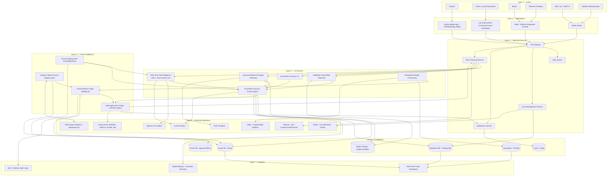

**Why this shape (traceability):** The Layer 4→5 split (AI Services vs. Threat Intelligence) exists because the Blueprint's Cluster A–D papers describe two genuinely distinct workloads: point-in-time classification (does this call/image/video look fraudulent?) versus continuously-updated, cross-source pattern intelligence (is this fraudulent pattern part of a known ring?). Collapsing them into one layer would force a single service to be both low-latency (sub-second call classification) and slow-changing/high-consistency (graph/RAG updates) — a real anti-pattern per the "Event-driven, multi-agent microservices architecture" recommendation in the Blueprint's Part 5 Architecture section. Layer 8 is deliberately drawn as *integration*, not *ownership* — this platform does not replace MuleHunter.AI, Pratibimb, ASTR, or CPFIR; Market Intel §3.1–3.2 documents that each already exists and is government-owned. Duplicating them would be exactly the "generic/unjustified" architecture the brief warns against.

---

# PART 2 — High-Level Architecture

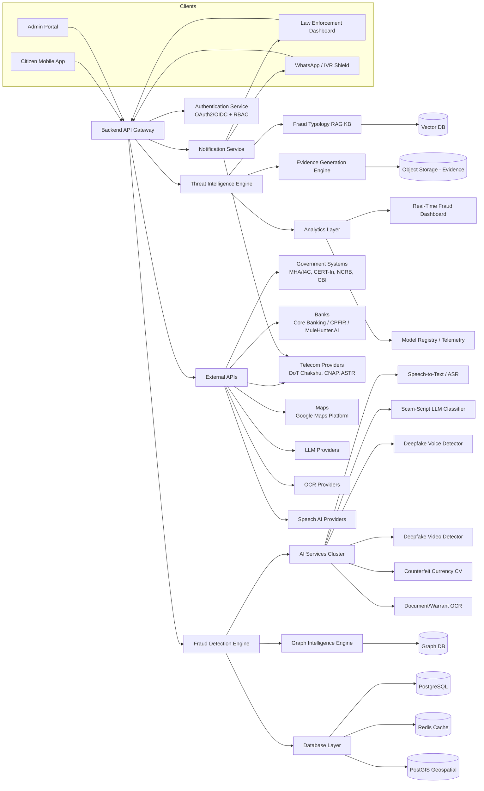

### Connection-by-connection explanation

| Connection | Direction | Purpose | Research basis |
|---|---|---|---|
| Citizen App / IVR-WhatsApp → API Gateway | Inbound | Single entry point for all citizen-facing traffic (multilingual fraud-check requests, complaint filing, voice checks) | Blueprint Feature 5 (Multilingual WhatsApp Fraud Shield), Feature 40 (IVR for feature-phone users) |
| LE Dashboard / Admin Portal → API Gateway | Inbound | Unified auth and routing for internal users; avoids each app talking directly to internal services | Standard enterprise pattern; justified by multi-stakeholder requirement in tasking |
| API Gateway → Auth Service | Sync (every request) | OAuth2/OIDC token validation + RBAC scoping (citizen vs. officer vs. bank vs. admin) | Market Intel gap: "no unified, cross-agency... system" (§3.2-3) demands strict scoping, not open access |
| API Gateway → Threat Intelligence Engine | Sync/Async | Routes case-lookup, evidence-request, and typology-query traffic | Blueprint Feature 18 (Fraud Typology RAG KB), Feature 42 (Fraud Pattern "CVE Database") |
| API Gateway → Fraud Detection Engine | Sync/Async | Routes real-time detection requests (call check, image check, transaction check) | Core of the "detect" stage in the challenge brief's detect→disrupt→respond pipeline |
| Fraud Detection Engine → AI Services Cluster | Async (event) | Dispatches to the specific classifier needed (ASR→script, image→CV, audio→deepfake) | Blueprint Clusters A (script), B (voice/video deepfake), C (counterfeit CV), G (document forensics) |
| AI Services → Graph Intelligence Engine | Async (event) | Every classified signal (mule-flagged account, spoofed number, scam script match) becomes a graph node/edge for ring detection | Blueprint Cluster D (D1–D5): fraud rings are a network-shape problem, not a single-signal problem |
| Graph Intelligence Engine → Graph DB | Sync | Multi-hop traversal (victim→mule→mule→exit) at millisecond latency | Blueprint Part 2 §1 (Graph Databases) |
| Threat Intelligence Engine → RAG KB | Sync | Retrieves latest known scam typology/pattern before scoring, so new scripts propagate without retraining | Blueprint A4 (RAG-based fraud detection), Feature 18 |
| Threat Intelligence Engine → Evidence Generation Engine | Async | Packages a GNN fraud-ring score + supporting subgraph into a human-readable, chain-of-custody dossier | Blueprint D5 (explainable GNN), Feature 7, Feature 43 (model-card audit trail) |
| Notification Service → Telecom / LE Dashboard / WhatsApp | Outbound | Delivers real-time alerts (in-call warning, MHA alert, officer escalation) | Blueprint Feature 23 (Automated MHA Alert Generator), Feature 1 (Live-Call Scam Script Classifier) |
| External APIs → Government/Bank/Telecom systems | Bidirectional, federated | Pulls Suspect Registry / MuleHunter.AI signals in; pushes derived fraud-ring alerts out — never a raw full-database sync | Market Intel §1.1 (RBI fiduciary confidentiality constraint), Blueprint Security §"Zero-trust access control... no agency gets raw access to another's full dataset, only to derived fraud signals" |
| Analytics Layer → Dashboard / Model Registry | Internal | Surfaces live trend view (Feature 49) and, critically, outcome telemetry that MuleHunter.AI itself cannot publish (P6) | Market Intel Closing Note; Blueprint Feature 43, 49 |


---

# PART 3 — Component-Level Architecture

Every component below exists because it closes a specific gap (P1–P10) or implements a specific feature from the Blueprint's 50-feature roadmap. Components are grouped by tier. "Priority" reflects the Blueprint's Hackathon-Value/Business-Value scoring, adapted to a production roadmap (P0 = MVP-critical, P1 = fast-follow, P2 = maturity phase).

## 3.1 Client Tier

| Component | Purpose | Inputs | Outputs | Dependencies | Owner | Technology | Priority |
|---|---|---|---|---|---|---|---|
| Citizen Mobile App (Citizen Fraud Shield) | Multilingual, pre-transaction verdict tool; lets a citizen check a call/message/QR/investment offer before paying (closes P8) | Voice recording, screenshot/image, chat text, QR payload | Real-time risk verdict, plain-language explanation | API Gateway, Auth, Notification Service | Platform Product Team | React Native (Android-first, per India's Android-majority base) | P0 |
| IVR / WhatsApp Fraud Shield | Extends protection to feature-phone/rural, non-app users (closes P8) | Phone call (IVR menu), WhatsApp message/voice note | Spoken/text verdict, guided next steps | Telecom integration, Notification Service | Platform Product Team | Telecom IVR gateway + WhatsApp Business API | P0 |
| Law Enforcement Command-Centre Dashboard | Officer console for case triage, graph exploration, geospatial hotspot view, evidence review | Alerts, case records, graph queries, geospatial layers | Case assignments, investigation notes, freeze/escalation requests | Threat Intelligence Engine, Graph Intelligence Engine, Geospatial service | Police/I4C-facing Product Team | React + TypeScript, Mapbox GL/Leaflet, react-force-graph (Neo4j Bloom-style) | P0 |
| Admin Portal | Platform configuration, model registry oversight, agency onboarding, RBAC management | Admin actions, model version approvals | Config changes, audit log entries | Auth Service, Model Registry | Platform Ops | React + TypeScript | P1 |
| Bank/Telecom Integration Console | Lets banks/telecom partners view derived fraud signals relevant to their own accounts/numbers (never raw cross-agency data) | Bank-side case references, telecom number reports | Scoped fraud signals, mule-account flags | API Gateway, Graph Intelligence Engine (scoped) | Platform Partnerships Team | React + TypeScript | P1 |

## 3.2 Backend Services Tier

| Component | Purpose | Inputs | Outputs | Dependencies | Owner | Technology | Priority |
|---|---|---|---|---|---|---|---|
| API Gateway | Single ingress; request routing, rate-limiting, schema validation | HTTPS/REST requests from all clients | Routed, authenticated requests | Auth Service | Platform Infra Team | Kong / AWS API Gateway equivalent on empanelled cloud | P0 |
| Authentication Service | Identity verification and RBAC scoping across 6 stakeholder types (citizen, police, bank, telecom, regulator, admin) | Credentials, tokens | OAuth2/OIDC tokens, role claims | Identity provider, PostgreSQL (user store) | Platform Security Team | Keycloak (self-hostable, government-deployable) | P0 |
| Case Management Service | Tracks a fraud/counterfeit case from citizen report through investigation to resolution | Citizen reports, alerts, officer actions | Case records, status updates | PostgreSQL, Notification Service | Police-facing Product Team | Node.js/NestJS | P0 |
| Alert & Routing Service | Routes a high-confidence detection to the correct jurisdiction/agency (closes cross-jurisdiction routing gap) | Fraud-detection verdicts, geospatial/jurisdiction metadata | Routed alerts to LE dashboard, MHA alert drafts, telecom flags | Threat Intelligence Engine, Notification Service | Platform Core Team | Node.js/NestJS + rule engine | P0 (maps to Feature 23, 25) |
| Notification Service | Delivers real-time alerts across channels (in-app, WhatsApp, SMS, IVR, dashboard push) | Alert events | Multi-channel messages | Telecom integration, WhatsApp Business API | Platform Core Team | Node.js event consumer + provider SDKs | P0 |

## 3.3 AI Services Tier

| Component | Purpose | Inputs | Outputs | Dependencies | Owner | Technology | Priority |
|---|---|---|---|---|---|---|---|
| Real-Time Call Intelligence Service | Streams call audio → ASR → scam-script LLM classification; the core answer to Gap P1 (pre-transfer interception) | Live/near-live call audio stream | Scam-probability score, matched script pattern, in-call warning | Speech AI provider, Fraud Typology RAG KB | AI Platform Team | Whisper-class ASR (Indian-language fine-tuned) + hosted LLM (A1/A3 pattern) | P0 (Feature 1) |
| Deepfake Voice Detection Service | Flags AI-cloned voice mid-call, addressing the collapse in voice-cloning cost/effort documented in Threat Intel §4.2 | Streamed audio | Synthetic-speech probability, confidence | Real-Time Call Intelligence Service | AI Platform Team | RTCFake/Fake-Mamba-pattern real-time classifier (B1/B2) | P1 (Feature 2 — Very High complexity per Blueprint) |
| Deepfake Video Detection Service | Flags synthetic video during "arrest" calls or investment-endorsement clips | Video stream/file | Manipulation probability, artefact localisation | Object storage (evidence retention) | AI Platform Team | FaceForensics++/DFDC-trained detector, in-the-wild tuned (DeepFake-Eval-2024 per Market Intel dataset table) | P2 (Feature 28 — Very High complexity, gap area) |
| Fake Officer / Document Verifier | Confirms if a claimed CBI/ED/Customs official or shown warrant/FIR is genuine | Claimed name/ID, document image | Match/no-match verdict against legitimate-entity KG | OCR service, Knowledge Graph | AI Platform Team | RAG + knowledge graph (KnowPhish/G2 pattern) + OCR (Tesseract/PaddleOCR/Cloud Vision) | P0 (Feature 3, 4 — Medium complexity, high value) |
| Counterfeit Currency CV Service | UV-hardware-free, phone-camera-based FICN detection for citizens/merchants; bank-counter plugin for tellers | Note image (RGB, optionally UV-augmented at bank counters) | Authenticity verdict, denomination, confidence, flagged security features | Object storage, OCR (prop-note text filter) | AI Platform Team | YOLO-NAS + UV-feature CNN ensemble (C1) with OCR pre-filter (C2) | P0 (Feature 10, 11 — direct answer to the single largest whitespace named in Market Intel) |
| Fraud Risk Scoring / Fusion Engine | Combines script-classifier + deepfake-detector + spoofing-signature + KG-lookup outputs into one sub-second decision (closes Gap P2) | Outputs of all above AI services | Unified risk score + rationale | All AI services, Graph Intelligence Engine | AI Platform Team | Hybrid rule + ML/GNN score-fusion layer (Cluster D pattern) | P0 |
| Geospatial Hotspot Forecasting Service | Forecasts tomorrow's fraud/counterfeit/cybercrime hotspots for patrol prioritisation | Historical + live geo-tagged complaint/seizure data | Hotspot forecast layer, confidence bands | PostGIS, Case Management Service | AI Platform Team | ConvLSTM (F3, best-evidenced F1=0.87) + XGBoost contextual features (F2) | P1 (Feature 14, 15) |

## 3.4 Threat Intelligence Tier

| Component | Purpose | Inputs | Outputs | Dependencies | Owner | Technology | Priority |
|---|---|---|---|---|---|---|---|
| Fraud Typology RAG Knowledge Base | Central, continuously updated store of known scam scripts, spoofing signatures, counterfeit techniques — so a new pattern propagates to every classifier within hours, not a retraining cycle | Curated documents, analyst-submitted new patterns, closed-case learnings | Retrieved context for classifiers | Vector DB, integrity monitor | AI Platform Team | pgvector/Milvus + curated document pipeline (A4, Feature 18) | P0 |
| RAG Poisoning Integrity Monitor | Detects tampering/poisoning of the shared knowledge store (a documented attack surface for RAG systems) | Write events to RAG KB | Anomaly alerts, write-access audit trail | RAG KB | Platform Security Team | Anomaly detection over retrieval-store updates (Feature 19) | P1 |
| Fraud Network Graph Intelligence Engine | Maps coordinated fraud campaigns (mule chains, ring structures) across transaction/call/device data | Flagged accounts, call metadata, device fingerprints, complaint narratives | Fraud-ring score, mule-chain reconstruction, court-admissible subgraph | Graph DB, LLM (for narrative-text fusion) | AI Platform Team | PyTorch Geometric/DGL GNN, LLM-enhanced (D2/FLAG), unsupervised chain-tracing (D3/MuleTrace) | P0 |
| Adversarial Graph-Injection Defence Module | Hardens the above against coordinated evasion by organised syndicates (a documented, not hypothetical, attack per D1) | Graph structure, historical attack patterns | Hardened model, anomaly flags on suspicious graph edits | Graph Intelligence Engine | AI Platform Team | Adversarial training vs. MonTi-style injection (D1) | P1 (Feature 9) |
| Multi-Agent Alert Triage (CORTEX pattern) | Filters the alert flood to the highest-severity, highest-confidence cases for human officers, with agent-role separation (evidence-gathering, cross-checking, escalation) | All AI-service and Graph-Engine outputs | Prioritised, human-reviewable alert queue | Fusion Engine, Graph Intelligence Engine | AI Platform Team | Multi-agent LLM collaboration under TRiSM governance (E1, E2) | P0 (Feature 24) |
| Suspect / Mule-Account Registry Sync | Federated, read-only sync with I4C's Suspect Registry and RBI's MuleHunter.AI outputs, without ingesting raw bank data (respects RBI's fiduciary-confidentiality constraint, per Market Intel §1.1) | Suspect-registry identifier feed (via MoU, not open API — Market Intel flags this as portal-based today) | Locally cached suspect/mule flags for graph enrichment | External government integration | Platform Partnerships Team | Scheduled federated sync job + local cache | P0 |
| Evidence Generation Engine | Converts a GNN fraud-ring score into a chain-of-custody-compliant, human-readable dossier for court/regulator submission (closes Gap P4, the named "auditability" evaluation criterion) | Graph subgraph, model version, classifier outputs | Structured PDF/JSON dossier with attached model card | Explainable GNN (D5), Model Registry | AI Platform + Legal/Compliance Team | Explainable-GNN attribution (D5) + LLM narrative generation (Feature 7) | P0 |

## 3.5 Data & Analytics Tier

| Component | Purpose | Inputs | Outputs | Dependencies | Owner | Technology | Priority |
|---|---|---|---|---|---|---|---|
| Graph Database | Stores accounts, calls, devices, transactions as nodes/edges for multi-hop fraud-ring traversal | Structured entities/relationships from all detection services | Query results (Cypher/Gremlin) | — | Data Platform Team | Neo4j (TigerGraph at national scale) | P0 |
| Relational Database | Transactional/citizen data: accounts, complaints, case records, RBAC | Case Management, Auth Service | Structured records | — | Data Platform Team | PostgreSQL | P0 |
| Vector Database | Embedding store for RAG retrieval and voiceprint/phoneme similarity search | Document embeddings, audio embeddings | Nearest-neighbour matches | PostgreSQL (if pgvector) | Data Platform Team | pgvector (simplicity-first) / Milvus (scale path) | P0 |
| Object Storage | Evidence retention: call recordings, images, video clips, generated dossiers | Media files from all AI services | Signed URLs, retention-policy-governed objects | Encryption/KMS | Data Platform Team | S3-compatible object storage on empanelled cloud | P0 |
| Cache | Sub-millisecond lookups for session state, hot suspect-registry entries, rate-limit counters | Frequently accessed keys | Cached values | — | Data Platform Team | Redis | P0 |
| Geospatial Store | Hotspot forecasting, patrol-allocation queries | Geo-tagged complaint/seizure records | Spatial query results | PostgreSQL | Data Platform Team | PostGIS extension on Postgres | P1 |
| Model Registry / Outcome Telemetry | Versions every deployed model with a model card; tracks real-world outcome metrics — the capability RBI's MuleHunter.AI explicitly lacks (P6) | Model artefacts, deployment events, downstream outcome labels (recovered funds, confirmed fraud) | Auditable model lineage, published efficacy metrics | MLOps pipeline | AI Platform Team | MLflow + model-card standard (Feature 43) | P0 |
| Bias / Fairness Audit Layer | Audits geospatial hotspot and risk-scoring outputs for demographic skew before any patrol-allocation or account-freeze recommendation ships | Model outputs, demographic metadata (aggregate, not individual) | Fairness report, gating decision | Geospatial service, Fusion Engine | Governance/Compliance Team | Fairness-metric toolkit over F1–F3-style outputs (Feature 16) | P1 — **mandatory gate, not optional**, per Blueprint F4's explicit bias warning |

---

# PART 4 — Data Flow Diagrams

Each flow below traces the "detect → disrupt → respond" pipeline named in the original challenge brief, with an explicit human-in-the-loop gate before any irreversible action (freeze, public alert) — the TRiSM governance requirement from Blueprint E1.

## 4.1 Digital Arrest Detection — End-to-End Flow

```mermaid
sequenceDiagram
    participant Citizen
    participant Telecom as Telecom / VoIP Carrier
    participant RTCI as Real-Time Call Intelligence
    participant DFV as Deepfake Voice Detector
    participant KG as Officer/Warrant KG Verifier
    participant Fusion as Fraud Risk Fusion Engine
    participant Triage as CORTEX-style Triage Agent
    participant Notif as Notification Service
    participant LE as LE Dashboard / MHA Alert

    Citizen->>Telecom: Receives call claiming "arrest"/Aadhaar link to crime
    Telecom->>RTCI: Streams call audio (with consent/opt-in per DoT flow)
    RTCI->>RTCI: ASR transcribes; scam-script LLM scores authority-impersonation cues
    RTCI->>DFV: Forwards audio segment
    DFV->>DFV: Scores synthetic-voice probability (RTCFake/Fake-Mamba pattern)
    Citizen->>KG: Optionally submits claimed officer name / shown warrant image
    KG->>KG: Cross-checks against legitimate-official KG + OCR'd warrant template
    RTCI->>Fusion: Script score
    DFV->>Fusion: Voice-clone score
    KG->>Fusion: Officer/warrant match score
    Fusion->>Fusion: Computes unified risk score + rationale
    Fusion->>Triage: High-risk case escalated
    Triage->>Triage: Cross-checks against known digital-arrest patterns (RAG KB)
    Triage->>Notif: Confidence above threshold - trigger in-call warning
    Notif->>Citizen: Real-time warning ("this matches a known digital-arrest script")
    Triage->>LE: Drafts MHA alert (human-gated before dispatch)
    LE->>LE: Officer reviews, confirms, routes to jurisdiction
```
**Interruption point:** Stage RTCI→Fusion→Notif is designed to complete before any fund transfer — directly answering Gap P1. The LE alert path always requires human confirmation before any account-freeze recommendation is issued (TRiSM gate).

## 4.2 Counterfeit Currency Detection — End-to-End Flow

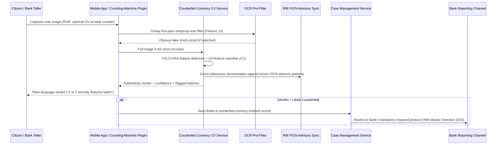
**Note:** Per the Master Direction on Counterfeit Notes 2025, a bank-side positive detection legally requires impounding, not returning, the note — the Case Management record exists to make that compliance step auditable, not optional.

## 4.3 Citizen Report — End-to-End Flow

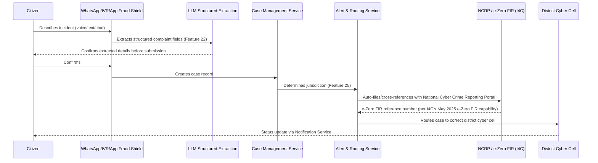

## 4.4 Fraud Network Investigation — End-to-End Flow

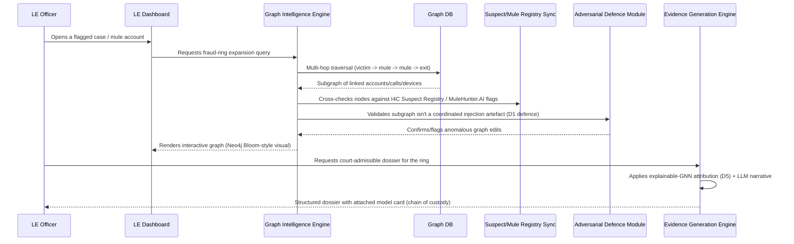

## 4.5 Evidence Generation — End-to-End Flow

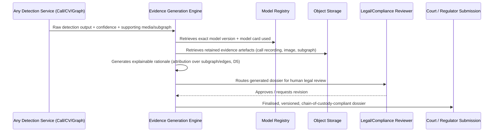
**Governance note:** No dossier is auto-submitted; Legal/Compliance review is a mandatory gate, consistent with TRiSM (E1) and the explicit requirement that "no black-box score may trigger an irreversible action... without an attached, human-readable rationale."

## 4.6 Threat Intelligence Update — End-to-End Flow

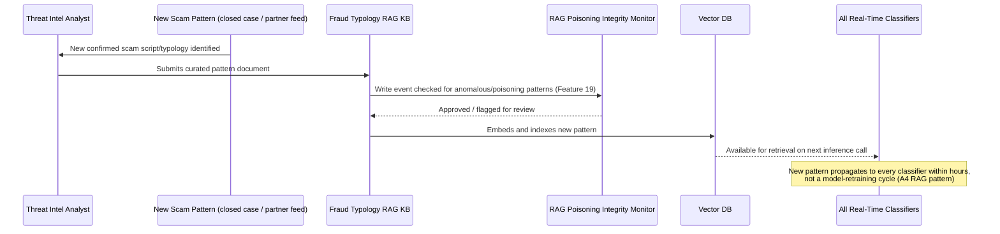

## 4.7 Real-Time Alert Generation — End-to-End Flow

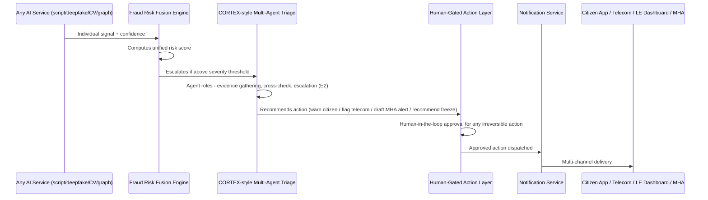

---

# PART 5 — Microservice Architecture

Each microservice is scoped to a single bounded context, per the Blueprint's recommendation for an "event-driven, multi-agent microservices architecture." Communication is event-driven (Kafka) for anything on the detect→disrupt→respond pipeline, and synchronous REST for request/response UI interactions.

| Microservice | Responsibilities | Key REST APIs | Database | Communication | Scaling Strategy | Security Considerations |
|---|---|---|---|---|---|---|
| **auth-service** | Login, token issuance, RBAC scoping across 6 stakeholder types | `POST /auth/login`, `POST /auth/refresh`, `GET /auth/me` | PostgreSQL (users, roles) | Sync REST | Horizontal, stateless (JWT) | MFA mandatory for police/bank/admin roles; short-lived tokens |
| **case-management-service** | CRUD on citizen reports, case lifecycle, officer assignment | `POST /cases`, `GET /cases/{id}`, `PATCH /cases/{id}/status` | PostgreSQL | Sync REST + Kafka events on status change | Horizontal, read replicas for dashboard queries | Row-level security by jurisdiction/agency |
| **call-intelligence-service** | Streaming ASR + scam-script classification | `POST /calls/stream` (gRPC/WebSocket), `GET /calls/{id}/verdict` | Redis (session state), Object Storage (retained audio) | Streaming (gRPC/WebSocket) + Kafka event emission on verdict | Auto-scaling pods keyed to concurrent call volume; GPU-backed for ASR | Consent/opt-in flag mandatory per call (DoT compliance, Feature 41) |
| **deepfake-voice-service** | Real-time synthetic-speech detection | `POST /audio/analyze` | Object Storage | Kafka consumer (audio segments) | GPU-backed horizontal scaling; latency-budgeted (Bi-Mamba for low-compute path, B2) | Model-version pinned per legal-evidence requirement |
| **deepfake-video-service** | Video manipulation detection | `POST /video/analyze` | Object Storage | Async job queue (Kafka) | Batch/async — not on the hot real-time path given "Very High" complexity/immaturity flagged in Blueprint | Chain-of-custody metadata attached to every result |
| **counterfeit-cv-service** | Note authenticity classification | `POST /currency/analyze` | Object Storage | Sync REST (mobile/bank-counter use case is interactive) | Horizontal, CPU-sufficient (lighter than video models); edge-deployable for bank counters | Image retention policy (evidence vs. privacy minimisation) |
| **document-forensics-service** | Warrant/court-order/letterhead forgery detection | `POST /documents/analyze` | Object Storage, Knowledge Graph (legitimate-entity templates) | Sync REST | Horizontal | OCR output never auto-trusted; always paired with KG cross-check |
| **fraud-fusion-service** | Combines all classifier outputs into one risk score | `POST /fusion/score` | Redis (short-lived score cache) | Kafka consumer/producer (event-driven) | Horizontal, stateless | Rate-limited per source to prevent score-flooding/DoS on fusion logic |
| **graph-intelligence-service** | Fraud-ring/mule-chain graph queries and scoring | `POST /graph/query`, `GET /graph/ring/{id}` | Neo4j | Sync (Cypher queries) + Kafka (new-edge ingestion) | Read replicas for investigator queries; write-path sharded by entity-type where scale demands (TigerGraph path) | Per-agency query scoping (zero-trust; no cross-agency raw traversal) |
| **rag-knowledge-service** | Fraud typology retrieval for classifiers | `POST /rag/query`, `POST /rag/documents` | pgvector/Milvus | Sync REST | Horizontal (stateless retriever); vector index sharded at scale | Write-access RBAC + poisoning-integrity monitor gate on every ingest |
| **triage-agent-service** | CORTEX-style multi-agent alert prioritisation | `POST /triage/evaluate` | Redis (agent working memory) | Kafka consumer/producer | Horizontal; agent-role pods can scale independently | TRiSM governance: agent identity + inter-agent comms authenticated, all decisions logged |
| **evidence-generation-service** | Builds court-admissible dossiers | `POST /evidence/generate`, `GET /evidence/{id}` | Object Storage, Model Registry | Async job queue | Batch-oriented, lower QPS than real-time services | Immutable, append-only evidence storage (WORM-style object lock) |
| **geospatial-service** | Hotspot forecasting, patrol-allocation recommendations | `GET /geo/hotspots`, `POST /geo/forecast` | PostGIS | Sync REST + scheduled batch (ConvLSTM retraining) | Horizontal for query path; batch compute for forecasting jobs | Bias/fairness audit gate before any output is surfaced to patrol-allocation consumers |
| **notification-service** | Multi-channel alert delivery | `POST /notify` | Redis (delivery queue), PostgreSQL (delivery log) | Kafka consumer + provider SDK calls | Horizontal, provider-rate-limit-aware | PII-minimised payloads; channel-specific encryption |
| **alert-routing-service** | Jurisdiction/agency routing logic | `POST /route`, `GET /route/rules` | PostgreSQL (routing rules) | Kafka consumer/producer | Horizontal, stateless | Routing-rule changes require admin approval + audit log |
| **suspect-registry-sync-service** | Federated sync with I4C Suspect Registry / RBI MuleHunter.AI feeds | `GET /registry/sync-status` (internal) | Local cache (Redis + Postgres) | Scheduled batch pull (MoU-based, not open API per Market Intel) | Low-QPS, scheduled | Read-only; never writes back to source-of-truth government systems |
| **model-registry-service** | Model versioning, model cards, outcome telemetry | `POST /models`, `GET /models/{id}/card`, `POST /models/{id}/outcome` | PostgreSQL + Object Storage (artefacts) | Sync REST | Low-QPS, high-durability | Immutable version history; this is the component that lets the platform do what MuleHunter.AI's fiduciary constraint prevents (publishable efficacy data) |
| **bias-audit-service** | Fairness auditing of geospatial and risk-scoring outputs | `POST /audit/run`, `GET /audit/{id}/report` | PostgreSQL | Scheduled batch + on-demand | Low-QPS | Independent reporting line to Admin Portal / oversight body, not gated by product team |

---

# PART 6 — Database Architecture

## 6.1 Entity-Relationship Overview (Relational Core)

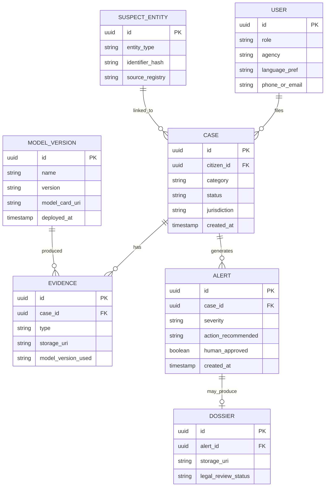

## 6.2 Graph Database Schema (Neo4j) — Fraud Network Layer

**Node types:** `Account`, `Person`, `Device`, `PhoneNumber`, `Transaction`, `MuleFlag`, `ScamScript`, `Case`.
**Relationship types:** `TRANSFERRED_TO`, `USED_DEVICE`, `CALLED_FROM`, `MATCHES_SCRIPT`, `FLAGGED_BY_REGISTRY`, `LINKED_TO_CASE`, `SAME_HOLDER_AS` (synthetic-identity linkage).

This is deliberately a separate database from the relational core: fraud-ring detection is a multi-hop traversal problem (victim→mule→mule→exit, per Blueprint D3/MuleTrace), which is native to a graph engine and computationally expensive to simulate via relational joins at national scale — the direct justification cited in Blueprint Part 2 §1.

## 6.3 Vector Database — RAG & Similarity Layer

Two logical collections on the same vector store:
1. **fraud-typology-embeddings** — chunked, embedded scam-script/typology documents for RAG retrieval (Feature 18).
2. **voiceprint-phoneme-embeddings** — enrolled reference voiceprints for the (opt-in, privacy-gated) government-helpline verification feature (Feature 21) — deliberately scoped to a Very High complexity, low-priority (P2) rollout given the consent/data-governance concerns Blueprint B3 explicitly flags.

`pgvector` is recommended as the default (co-located with the relational Postgres instance, minimising operational surface for a government deployment where auditability matters as much as raw performance, per Blueprint Part 5). Migrate to Milvus only if embedding-count/query-load growth demands dedicated infrastructure.

## 6.4 Object Storage

Buckets: `call-recordings/`, `note-images/`, `video-evidence/`, `dossiers/`, `model-artefacts/`. All evidence-bearing buckets use object-lock/WORM configuration once a case is opened, so that evidence cannot be altered post-collection — a direct requirement of the "auditability of intelligence packages for legal admissibility" evaluation criterion.

## 6.5 Caching

Redis is used for: (a) session/auth token state, (b) short-lived fusion-engine score caching (avoid re-scoring identical inputs within a call), (c) hot suspect-registry lookups (avoid a Neo4j round-trip on every call-intelligence check), (d) rate-limiting counters at the API Gateway.

## 6.6 Geospatial Store

PostGIS extension on the same PostgreSQL cluster used for relational data — chosen specifically (per Blueprint Part 5) to avoid introducing a fourth database technology purely for geospatial queries, since PostGIS is the de facto standard and integrates natively.

---

# PART 7 — AI Architecture

## 7.1 AI Modules and Their Interaction

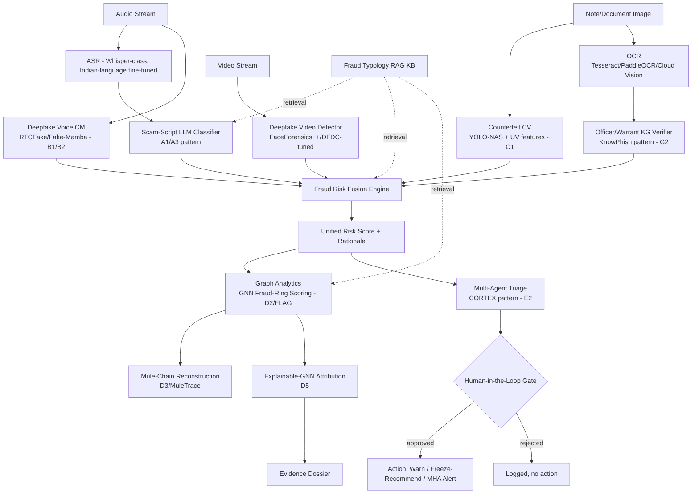

## 7.2 Module-by-Module Rationale

| AI Module | Interacts With | Why This Design |
|---|---|---|
| Speech Analysis (ASR + diarization) | Feeds Scam-Script Classifier and Deepfake Voice CM in parallel | You cannot classify what you haven't transcribed (Blueprint A1–A5 dependency chain); diarization separates victim vs. scammer speech for cleaner downstream classification |
| LLM Reasoning (scam-script, dossier narrative, multilingual advisory) | Retrieves from RAG KB; feeds Fusion Engine; feeds Evidence Generation | A hosted frontier LLM handles high-stakes triage reasoning quality (E2); a smaller fine-tuned/self-hosted model handles high-volume, latency-sensitive classification — dual-tier per Blueprint Part 5 AI Stack recommendation |
| Counterfeit Detection (CV) | Feeds Fusion Engine (for combined citizen-facing verdicts) and directly serves bank-counter/citizen use cases | YOLO-NAS + UV-feature ensemble is the most recent (2025), Indian-banknote-specific architecture reviewed (C1); OCR pre-filter (C2) cheaply catches obvious prop-note fakes before invoking the heavier CV pipeline |
| Fraud Classification (Fusion Engine) | Aggregates all classifier outputs; feeds Graph Analytics and Triage | No single model is sufficient — production fraud systems layer rules (instant, interpretable) with ML/GNN (catches novel patterns), per Blueprint Cluster D rationale |
| Risk Scoring | Same as above — output of Fusion Engine | Must support the brief's explicit "very low false-positive rate" requirement for citizen-facing tools — achieved via rule+ML score fusion with tunable thresholds, not a single opaque model |
| Graph Analytics (GNN) | Consumes Fusion Engine output + Graph DB; feeds Explainable-GNN and Mule-Chain Reconstruction | Fraud rings are a network-*shape* problem; LLM-enhanced GNN (D2/FLAG) fuses structural graph learning with semantic complaint-text signals for a richer score than either alone |

## 7.3 Model Governance Loop

Every model in 7.1 is registered in **model-registry-service** with a model card before production use (Feature 43). Outcome telemetry (confirmed fraud, recovered funds, false-positive reports) flows back into the registry, closing the loop that RBI's own MuleHunter.AI cannot close today due to fiduciary/RTI constraints (Market Intel §1.1, P6) — this is a first-order design goal, not a nice-to-have.

---

# PART 8 — Security Architecture

Security requirements below are driven directly by two named constraints in the research: (a) the RBI's own fiduciary-confidentiality limits on data-sharing (Market Intel §1.1), which mean this platform must be built zero-trust from day one rather than assuming open inter-agency data access; and (b) the Blueprint's TRiSM (E1) and adversarial-robustness (D1, A5) findings, which mean every AI decision that can trigger an action must be gated, logged, and hardened against adversarial input.

| Area | Design | Rationale |
|---|---|---|
| **Authentication** | OAuth2/OIDC via Keycloak; mandatory MFA for police/bank/admin roles; citizen-facing auth can use lighter phone-OTP flow to keep the Citizen Fraud Shield frictionless | 6 distinct stakeholder types (per tasking) need differentiated auth strength, not one-size-fits-all |
| **Authorization** | Fine-grained RBAC + per-agency data-scoping: banks see only their own flagged accounts; telecoms see only their own flagged numbers; police see cases in their jurisdiction; no agency gets raw cross-agency access, only derived fraud signals | Directly implements the Blueprint's explicit security recommendation and answers Gap P4/P9 (cross-agency fusion without violating jurisdictional data-sharing law) |
| **Encryption** | TLS 1.3 in transit; AES-256 at rest for object storage and databases; envelope encryption via a government-approved KMS for evidence buckets | Standard for a platform handling call recordings, financial data, and personal identity documents |
| **Audit Logs** | Every API call, model inference used in a decision, and admin action is logged to an append-only audit store, separate from operational databases | Required for the "auditability of intelligence packages for legal admissibility" evaluation criterion named in the brief |
| **Evidence Integrity** | WORM/object-lock on all evidence buckets once a case is opened; every dossier references an immutable model-version ID (model-registry-service) | Chain-of-custody requirement for court submission (Blueprint D5, Feature 43) |
| **Role-Based Access** | Citizen / Bank / Telecom / Police-Officer / Regulator (RBI-I4C-CERT-In) / Platform-Admin — six distinct role classes with least-privilege scoping | Matches the six stakeholder groups named in the tasking exactly |
| **API Security** | API Gateway enforces schema validation, rate-limiting, and mutual-TLS for agency-to-agency federated sync (Suspect Registry, MuleHunter.AI feeds) | Prevents both abuse of citizen-facing endpoints and spoofed inter-agency traffic |
| **Secure Storage** | PII minimisation by default (store hashes/references where possible, not raw Aadhaar/PAN); voiceprint enrollment (Feature 21) uses privacy-preserving matching (on-device comparison or encrypted templates), never centralised raw-audio storage | Directly follows the Blueprint's explicit privacy-by-design requirement for the voiceprint-registry feature, flagged as a Very High-complexity, consent-sensitive rollout |
| **Incident Logging** | Security incidents (auth anomalies, suspected RAG-poisoning attempts, adversarial-graph-injection alerts) route to a dedicated Security Operations queue, separate from the fraud-alert queue | Keeps "platform under attack" signals distinct from "platform detecting a scam," avoiding alert-fatigue conflation |
| **Adversarial Robustness** | Every classifier (scam-script, deepfake-voice, GNN fraud-ring) is red-teamed in CI/CD against known attack methodologies (MonTi-style graph injection per D1; adversarial-paraphrase text per A5) before each release | These are documented, real attack techniques in the source research, not hypothetical — treating them as standing test suites rather than one-time audits |
| **Explainability-by-Default** | No model output may trigger an MHA alert, account-freeze recommendation, or court submission without an attached, human-readable rationale | Direct implementation of TRiSM (E1) and the explicit "no black-box score" principle from the Blueprint's Security section |

---

# PART 9 — Deployment Architecture

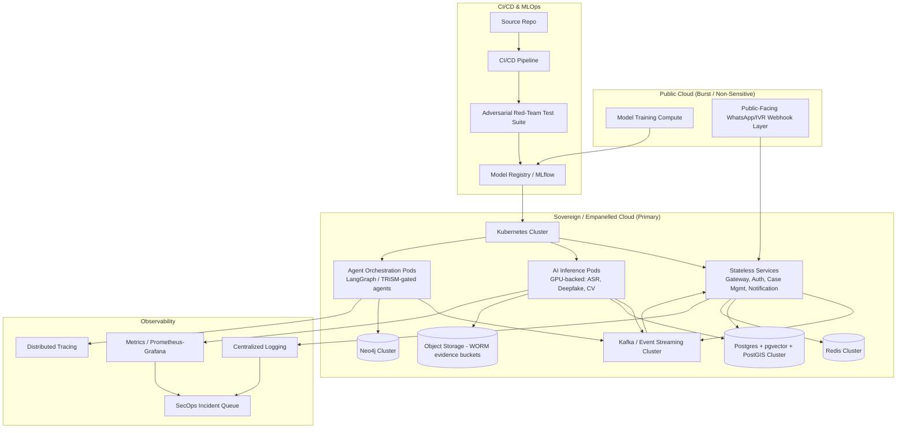

| Layer | Recommendation | Rationale |
|---|---|---|
| **Frontend** | React + TypeScript (web dashboards), React Native (citizen mobile app) | Matches Blueprint Part 5's explicit recommendation; component reuse across citizen app and officer console reduces build time |
| **Backend** | Python/FastAPI for AI-serving endpoints; Node.js/NestJS for transactional citizen-facing services | FastAPI's async model-serving integrates with the Python-native ML/GNN ecosystem (PyG/DGL); Node.js suits high-concurrency I/O-bound traffic (WhatsApp/IVR webhooks) |
| **Containers** | Kubernetes (K8s) for all services | Standard for independently scaling model-serving vs. transactional services; supports multi-tenant needs of a multi-agency platform |
| **Cloud** | Government-approved sovereign/MeitY-empanelled cloud for sensitive data (transaction graphs, voiceprints, case records, evidence); hybrid burst capacity on public cloud for stateless/non-sensitive workloads (public WhatsApp/IVR layer, model-training compute) | Data-sovereignty and legal-admissibility requirements for a government public-safety platform mandate in-country/empanelled infrastructure — a compliance requirement, not a preference (Blueprint Part 5 Cloud section) |
| **CI/CD** | Pipeline mandates the adversarial red-team suite (D1/A5-based) as a blocking gate before any classifier reaches the model registry | Treats adversarial robustness as a release gate, not a periodic audit |
| **Monitoring/Logging/Observability** | Centralised logging, Prometheus/Grafana-style metrics, distributed tracing across the event-driven pipeline; a dedicated SecOps incident queue separate from the fraud-alert queue | Needed to observe a genuinely event-driven, multi-agent pipeline where a single citizen call can fan out across 5+ services in real time |
| **Message Queue** | Kafka (or managed equivalent) as the backbone for all real-time detection and alert events | Required by the sub-second call-classification and fraud-ring-scoring latency budgets (Blueprint Part 5 Backend section) |
| **MLOps** | MLflow-based model registry with mandatory model-card documentation for every deployed version | Legal-admissibility and auditability requirement — every fraud-ring score used as evidence must trace to an exact, versioned, documented model |

---

# PART 10 — Final Architecture Review (Self-Critique)

A design review is only credible if it interrogates its own weaknesses. The following is a candid assessment against the standard an enterprise architecture review board (Microsoft/Palantir/AWS-style) would apply.

## 10.1 Bottlenecks
- **Fraud Risk Fusion Engine** is a hard synchronization point: every real-time signal (script, voice-deepfake, KG-lookup) must arrive and be combined within the sub-second budget needed for in-call interception (Gap P1). If any one upstream classifier (e.g., Deepfake Video, which the Blueprint itself rates "Very High" complexity/immaturity) is slow or unavailable, the Fusion Engine must degrade gracefully (score on available signals) rather than block — this graceful-degradation logic is not yet specified and is a genuine open design item.
- **Graph Intelligence Engine writes** at national transaction/call scale is a documented hard problem even in the source research (Blueprint Part 2 §1: "write-heavy real-time ingestion... needs careful sharding"). This is the single most likely scaling bottleneck if the platform reaches MuleHunter.AI-equivalent volume (23+ banks, national mule-account scale).

## 10.2 Single Points of Failure
- **Suspect/Mule Registry Sync Service** depends entirely on a government MoU-based, portal-oriented feed (Market Intel explicitly notes this is "largely portal-based today, not a documented public API"). If that federated sync breaks or is throttled by the source agency, Graph Intelligence quality degrades silently unless an explicit staleness-alert is built — currently a gap in this design, flagged here rather than hidden.
- **RAG Knowledge Base** is a single shared dependency for the Scam-Script Classifier, Fusion Engine, and Graph Intelligence. The RAG Poisoning Integrity Monitor mitigates the *security* risk, but there is no described secondary/fallback knowledge source if the RAG service itself has an outage — availability SPOF, not just an integrity risk.

## 10.3 Scalability Issues
- The dual-tier LLM strategy (frontier LLM for triage reasoning, smaller self-hosted model for high-volume classification) is the right call per the Blueprint, but cost/latency modelling at true national scale (millions of daily calls) is not yet sized — the architecture assumes this trade-off works but a load-test/cost-model phase is a required next step, not assumed.
- Continual/lifelong graph learning (D4) is explicitly still an immature production pattern per the cited review paper itself ("practical continual-learning deployments at bank/regulator scale remain immature") — this platform's Graph Intelligence Engine inherits that immaturity risk; a full model-retraining fallback path must exist for when continual learning underperforms.

## 10.4 Security Risks
- **Voiceprint enrollment (Feature 21)** remains the highest-risk single feature in this architecture from a privacy/consent standpoint — enrolling reference voiceprints of real government officials at national scale has no established privacy-preserving precedent per the source research itself. This design deliberately keeps it P2/opt-in-only rather than a launch feature, but flags it as an area where legal review must precede any pilot, not follow it.
- **Agentic-AI attack surface**: per Blueprint E5 (INTERPOL's March 2026 assessment), attacker-side agentic AI is already operating at scale. This platform's own multi-agent Triage layer is itself a target for adversarial manipulation (prompt injection into call transcripts, adversarially crafted images designed to fool the CV pipeline) — the red-team gate in Part 8/9 addresses known attack classes (D1, A5) but cannot claim coverage against not-yet-published attack techniques; this is a standing risk, not a solved problem.

## 10.5 Missing Components (Honest Gaps)
- **No dedicated component for cross-border/Interpol-level data exchange** is specified beyond "External APIs → Government Systems." Given that Threat Intel §4.9 documents Southeast Asian scam-compound infrastructure as a primary origination point, and CBI's Supreme Court mandate explicitly includes Interpol assistance, a future-phase **International Liaison Data Exchange Service** should be added — this architecture does not yet design it in detail because the research does not describe an existing technical interface to build against (a genuine gap in the source material, not an oversight to paper over).
- **No dedicated Bank/Telecom-side deployment package** is specified (e.g., an SDK banks could embed in their own onboarding flow, as the Market Intel report notes Signzy/HyperVerge/IDfy already provide commercially). This architecture assumes API-level integration; a lighter-weight embeddable SDK is a plausible fast-follow, not included in the P0 roadmap here.
- **Fairness/Bias Audit Layer is currently gating only geospatial and risk-scoring outputs.** It should arguably also gate the Fraud Network Graph Intelligence Engine's ring-detection outputs, since GNN-based financial-crime detection carries similar equity risks to predictive policing (disproportionate flagging of certain account-holder demographics) — this is not explicitly covered in the source research's fairness discussion (which focuses on geospatial/hotspot bias, per F4) but is a reasonable extension flagged for the design-review record.

## 10.6 Suggested Improvements (Roadmap Priority)
1. **Phase 0 (before any pilot):** Legal review of voiceprint enrollment and cross-border data-sharing constraints; load-test the Fusion Engine's graceful-degradation path.
2. **Phase 1 (MVP, P0 components only):** Citizen Fraud Shield (call/QR/document check), Counterfeit CV Service, Case Management, basic Graph Intelligence (single-institution scope), CORTEX-style triage with human gate, Model Registry from day one (so efficacy is measurable, unlike MuleHunter.AI).
3. **Phase 2:** Cross-agency federated graph fusion (scoped, zero-trust), Evidence Generation Engine, Geospatial forecasting, Bias Audit expansion to graph outputs.
4. **Phase 3:** Deepfake video detection (given its documented immaturity), voiceprint enrollment (pending legal clearance), International Liaison Data Exchange Service.

This phasing is deliberate: it puts the two capabilities named as the clearest, most defensible whitespace in the research — pre-transaction interception and consumer-facing counterfeit detection — into Phase 1, and defers the highest-legal-risk, least-evidenced components (voiceprint registries, cross-border raw data fusion) until governance catches up with the technology, rather than shipping them first because they are technically impressive.
