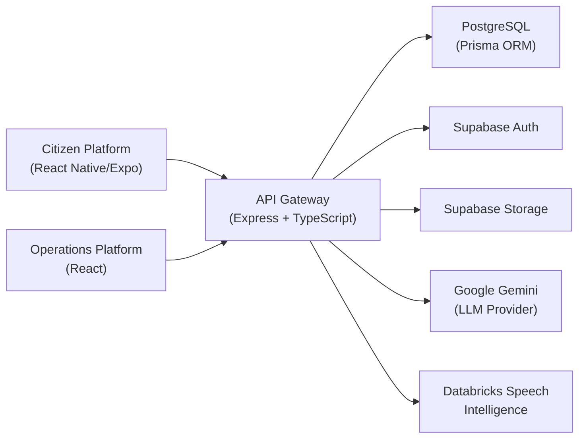
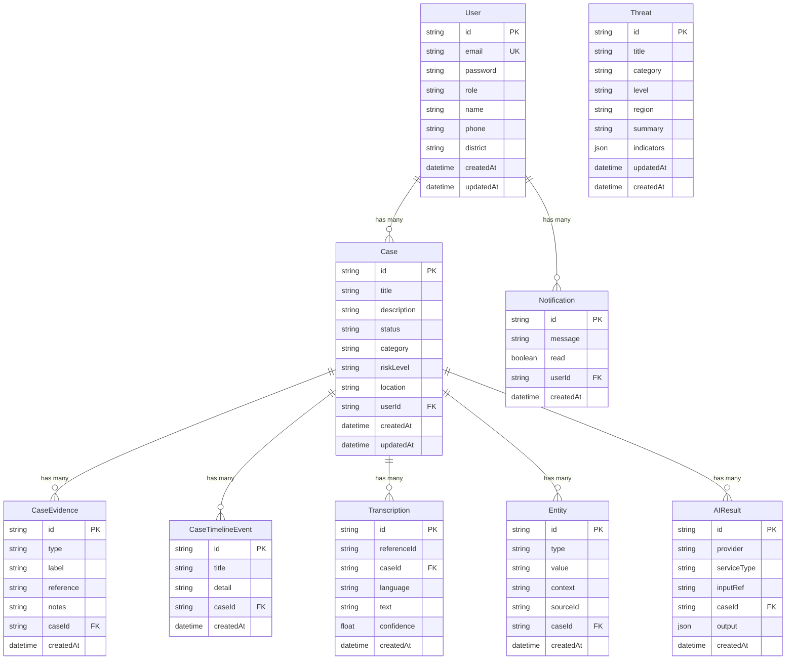

# Netrak Technical Design Document Data

---

## 1. PROJECT OVERVIEW

### Project Name
Netrak

### Tagline
AI-Native Public Safety & Investigation Platform

### Purpose
Transform fragmented citizen reports into structured investigative intelligence using AI, speech intelligence, and geospatial analytics.

### Primary Users
- Citizens: Incident reporting, evidence submission, case tracking
- Law Enforcement Officers/Investigators: Investigation management, operational monitoring, AI-assisted analysis
- Command Center Teams: Live incident overview
- Platform Administrators: User/Platform management

### Problem Solved
Addresses inefficiencies in traditional complaint management systems:
- Unstructured reports from multiple channels
- Manual evidence processing
- Fragmented data
- Limited situational awareness
- Slow investigation turnaround
- Minimal AI assistance

### Target Domain
Public Safety, Law Enforcement, Investigation Management

### Hackathon Mapping
- Hackathon: ET AI Hackathon 2.0
- Team: The Elite Party

### Repository Structure
```text
Netrak/
├── .github/          # GitHub workflows
├── apps/
│   ├── mobile/       # Expo React Native citizen app
│   └── operations/   # React + TypeScript operations dashboard
├── backend/
│   ├── gateway/      # Express + TypeScript API gateway
│   └── services/     # (Placeholder for future services)
├── docs/             # Technical and design docs
├── netrak_speech_intelligence/  # Python speech intelligence prototype
├── shared/           # (Placeholder for shared types/utils)
└── README.md         # Root project readme
```

### Technology Overview
- Frontend (Operations): React 19, TypeScript, Vite, Tailwind CSS
- Mobile: React Native, Expo, Expo Router, Zustand
- Backend: Node.js, Express, TypeScript
- Database: PostgreSQL, Prisma ORM
- AI: Google Gemini, Databricks Speech Intelligence
- Mapping: OpenStreetMap, Leaflet, React Leaflet
- Auth: Supabase Auth, JWT
- Storage: Supabase Storage
- API Docs: Swagger/OpenAPI
- Validation: Zod
- Data Fetching: TanStack Query (Operations); Axios (Mobile)

---

## 2. SYSTEM ARCHITECTURE

### High-Level Architecture


### Frontend (Operations) Architecture
- Routing: React Router
- State Management: React Context (Auth), TanStack Query (Data Fetching)
- UI: Tailwind CSS, Lucide Icons, Recharts
- Maps: Leaflet, React Leaflet, OpenStreetMap

### Backend Architecture
- Framework: Express
- API Layer: RESTful
- Middleware: Auth (JWT), CORS, Helmet, Rate Limiting, Multer (File Upload)
- Services Layer: Business logic for Cases, Evidence, Notifications, Threats, AI
- Providers Layer: AI Provider registry (Gemini for LLM, Databricks for Speech)
- Persistence: Prisma ORM + PostgreSQL

### Mobile Architecture
- Framework: Expo (React Native)
- Routing: Expo Router
- State Management: Zustand
- UI: React Native Paper
- Secure Storage: Expo Secure Store

### Database
- PostgreSQL with Prisma ORM
- Two schemas: `public`, `auth` (auth schema for future Supabase integration)
- Tables: User, Case, CaseEvidence, CaseTimelineEvent, Notification, Threat, AIResult, Transcription, Entity, ThreatScore, AIInferenceHistory, Embedding

### External Services
- Supabase Auth: Authentication
- Supabase Storage: Evidence file storage
- Google Gemini: LLM for summarization, entity extraction
- Databricks Speech Intelligence: Speech-to-text transcription

### AI Services
- AI Provider Registry: Abstraction layer for LLM and Speech providers
- LLM Provider: Gemini (summarization, entity extraction)
- Speech Provider: Databricks (speech transcription)
- AI Pipeline Service: Orchestrates the full pipeline (transcribe → summarize → extract entities)

### Authentication
- Supabase Auth (initial)
- JWT-based authentication in API
- Auth middleware validates JWT
- Role-based access control (roles: CITIZEN, OFFICER, ADMIN)

---

## 3. REPOSITORY STRUCTURE

### Complete Folder Tree
```text
Netrak/
├── .github/
│   └── workflows/
│       ├── codeql.yml
│       └── release-candidate.yml
├── apps/
│   ├── mobile/
│   │   ├── src/
│   │   │   ├── app/
│   │   │   │   ├── (auth)/
│   │   │   │   ├── (tabs)/
│   │   │   │   │   ├── case/
│   │   │   │   │   ├── dashboard.tsx
│   │   │   │   │   ├── history.tsx
│   │   │   │   │   ├── network.tsx
│   │   │   │   │   ├── notifications.tsx
│   │   │   │   │   ├── profile.tsx
│   │   │   │   │   ├── report.tsx
│   │   │   │   │   ├── settings.tsx
│   │   │   │   │   ├── sos.tsx
│   │   │   │   │   ├── threats.tsx
│   │   │   │   │   └── upload.tsx
│   │   │   │   ├── _layout.tsx
│   │   │   │   └── index.tsx
│   │   │   ├── components/
│   │   │   │   ├── cases/
│   │   │   │   ├── evidence/
│   │   │   │   ├── notifications/
│   │   │   │   ├── threats/
│   │   │   │   └── ui/
│   │   │   ├── constants/
│   │   │   ├── hooks/
│   │   │   ├── services/
│   │   │   │   ├── apiClient.ts
│   │   │   │   ├── apiError.ts
│   │   │   │   ├── authApi.ts
│   │   │   │   ├── axios.ts
│   │   │   │   ├── caseApi.ts
│   │   │   │   ├── config.ts
│   │   │   │   ├── healthApi.ts
│   │   │   │   ├── interceptors.ts
│   │   │   │   ├── notificationApi.ts
│   │   │   │   ├── preferencesStorage.ts
│   │   │   │   ├── sessionEvents.ts
│   │   │   │   ├── threatApi.ts
│   │   │   │   └── tokenStorage.ts
│   │   │   ├── store/
│   │   │   │   ├── authStore.ts
│   │   │   │   ├── caseStore.ts
│   │   │   │   ├── notificationStore.ts
│   │   │   │   ├── settingsStore.ts
│   │   │   │   ├── themeStore.ts
│   │   │   │   ├── threatStore.ts
│   │   │   │   └── userStore.ts
│   │   │   ├── types/
│   │   │   │   ├── index.ts
│   │   │   │   └── navigation.ts
│   │   │   └── utils/
│   │   ├── .env.example
│   │   ├── app.json
│   │   ├── eslint.config.js
│   │   ├── package.json
│   │   └── tsconfig.json
│   └── operations/
│       ├── src/
│       │   ├── app/
│       │   │   ├── App.tsx
│       │   │   ├── AppShell.tsx
│       │   │   ├── ThemeProvider.tsx
│       │   │   ├── navigation.ts
│       │   │   ├── routeValidator.ts
│       │   │   └── routes.ts
│       │   ├── components/
│       │   │   ├── BrandLogo.tsx
│       │   │   ├── NetrakLoader.tsx
│       │   │   └── ui.tsx
│       │   ├── data/
│       │   │   ├── fallbackData.ts
│       │   │   ├── queries.ts
│       │   │   └── repositories.ts
│       │   ├── features/
│       │   │   ├── auth/
│       │   │   │   ├── AuthContext.tsx
│       │   │   │   ├── Callback.tsx
│       │   │   │   └── LoginPage.tsx
│       │   │   └── search/
│       │   │       └── GlobalSearch.tsx
│       │   ├── hooks/
│       │   │   ├── ai/
│       │   │   ├── useModalFocus.ts
│       │   │   └── useNetworkStatus.ts
│       │   ├── lib/
│       │   │   ├── apiClient.ts
│       │   │   ├── config.ts
│       │   │   └── format.ts
│       │   ├── pages/
│       │   │   ├── landing/
│       │   │   ├── AdminPortal.tsx
│       │   │   ├── AnalyticsPage.tsx
│       │   │   ├── CaseQueue.tsx
│       │   │   ├── CommandCenter.tsx
│       │   │   ├── EvidenceExplorer.tsx
│       │   │   ├── HeatMapPage.tsx
│       │   │   ├── InvestigationWorkspace.tsx
│       │   │   ├── NotFoundPage.tsx
│       │   │   ├── NotificationsPage.tsx
│       │   │   ├── OfficerDashboard.tsx
│       │   │   ├── ProfilePage.tsx
│       │   │   ├── ThreatIntelligence.tsx
│       │   │   └── TimelineExplorer.tsx
│       │   ├── styles/
│       │   │   └── global.css
│       │   ├── types/
│       │   │   └── index.ts
│       │   └── main.tsx
│       ├── tests/
│       │   └── format.test.ts
│       ├── .env.example
│       ├── eslint.config.js
│       ├── index.html
│       ├── package.json
│       ├── postcss.config.cjs
│       ├── tailwind.config.cjs
│       ├── tsconfig.json
│       └── vite.config.ts
├── backend/
│   ├── gateway/
│   │   ├── prisma/
│   │   │   ├── migrations/
│   │   │   ├── schema.prisma
│   │   │   └── seed.ts
│   │   ├── scripts/
│   │   │   ├── validate-prisma.cjs
│   │   │   └── verify-integration.ts
│   │   ├── src/
│   │   │   ├── ai/
│   │   │   │   ├── controllers/
│   │   │   │   │   ├── ai-llm.controller.ts
│   │   │   │   │   └── ai-speech.controller.ts
│   │   │   │   ├── interfaces/
│   │   │   │   │   ├── llm-provider.interface.ts
│   │   │   │   │   ├── provider.interface.ts
│   │   │   │   │   └── speech-provider.interface.ts
│   │   │   │   ├── jobs/
│   │   │   │   │   ├── in-process.queue.ts
│   │   │   │   │   └── queue.interface.ts
│   │   │   │   ├── providers/
│   │   │   │   │   ├── llm/
│   │   │   │   │   │   └── GeminiProvider.ts
│   │   │   │   │   ├── speech/
│   │   │   │   │   │   └── databricks-speech.provider.ts
│   │   │   │   │   └── registry.ts
│   │   │   │   ├── routes/
│   │   │   │   │   └── ai.routes.ts
│   │   │   │   └── services/
│   │   │   │       ├── aiPipeline.service.ts
│   │   │   │       ├── llm.service.ts
│   │   │   │       └── speech.service.ts
│   │   │   ├── common/
│   │   │   │   ├── AppError.ts
│   │   │   │   ├── logger.ts
│   │   │   │   └── response.ts
│   │   │   ├── config/
│   │   │   │   ├── env.ts
│   │   │   │   ├── supabase.ts
│   │   │   │   └── swagger.ts
│   │   │   ├── controllers/
│   │   │   │   ├── auth.controller.ts
│   │   │   │   ├── case.controller.ts
│   │   │   │   ├── evidence.controller.ts
│   │   │   │   ├── notification.controller.ts
│   │   │   │   ├── storage.controller.ts
│   │   │   │   └── threat.controller.ts
│   │   │   ├── database/
│   │   │   │   └── prisma.ts
│   │   │   ├── dto/
│   │   │   │   ├── auth.dto.ts
│   │   │   │   ├── case.dto.ts
│   │   │   │   ├── common.dto.ts
│   │   │   │   ├── evidence.dto.ts
│   │   │   │   ├── notification.dto.ts
│   │   │   │   ├── storage.dto.ts
│   │   │   │   └── threat.dto.ts
│   │   │   ├── middleware/
│   │   │   │   ├── auth.middleware.ts
│   │   │   │   ├── error.middleware.ts
│   │   │   │   ├── multer.ts
│   │   │   │   ├── rate-limit.middleware.ts
│   │   │   │   └── validate.middleware.ts
│   │   │   ├── repositories/
│   │   │   │   ├── case.repository.ts
│   │   │   │   ├── evidence.repository.ts
│   │   │   │   ├── notification.repository.ts
│   │   │   │   ├── threat.repository.ts
│   │   │   │   └── user.repository.ts
│   │   │   ├── routes/
│   │   │   │   ├── auth.routes.ts
│   │   │   │   ├── case.routes.ts
│   │   │   │   ├── health.routes.ts
│   │   │   │   ├── index.ts
│   │   │   │   ├── notification.routes.ts
│   │   │   │   ├── storage.routes.ts
│   │   │   │   └── threat.routes.ts
│   │   │   ├── services/
│   │   │   │   ├── auth.service.ts
│   │   │   │   ├── case.service.ts
│   │   │   │   ├── evidence.service.ts
│   │   │   │   ├── notification.service.ts
│   │   │   │   ├── storage.service.ts
│   │   │   │   └── threat.service.ts
│   │   │   ├── app.ts
│   │   │   └── server.ts
│   │   ├── tests/
│   │   │   ├── database.integration.test.cjs
│   │   │   └── security.contract.test.cjs
│   │   ├── .dockerignore
│   │   ├── .env.example
│   │   ├── Dockerfile
│   │   ├── eslint.config.mjs
│   │   ├── package.json
│   │   └── tsconfig.json
│   └── services/
├── docs/
│   ├── architecture/
│   ├── design/
│   ├── examples/
│   ├── postman/
│   └── research/
├── netrak_speech_intelligence/
│   └── netrak_speech_intelligence/
│       ├── config/
│       ├── docs/
│       ├── models/
│       ├── resources/
│       ├── schemas/
│       ├── services/
│       ├── .env.example
│       ├── app.py
│       ├── app.yaml
│       └── requirements.txt
├── shared/
│   ├── types/
│   └── utils/
├── .editorconfig
├── .gitattributes
├── .gitignore
├── .vercelignore
├── README.md
├── SECURITY.md
├── package-lock.json
├── package.json
├── restart-servers.ps1
└── vercel.json
```

### Purpose of Major Folders
- `.github/workflows`: CI/CD workflows (CodeQL, Release Candidate)
- `apps/mobile`: Citizen-facing mobile app (Expo React Native)
- `apps/operations`: Law Enforcement operations dashboard (React + Vite)
- `backend/gateway`: Central API gateway handling all platform requests
- `docs`: Project documentation (architecture, design, research)
- `netrak_speech_intelligence`: Standalone Python speech intelligence prototype
- `shared`: Shared types and utilities (placeholder)

---

## 4. FEATURE INVENTORY

### Implemented Features

#### 1. User Authentication & Authorization
- **Description**: User registration, login, JWT-based auth, role-based access control
- **Files Involved**: 
  - `backend/gateway/src/controllers/auth.controller.ts`
  - `backend/gateway/src/services/auth.service.ts`
  - `backend/gateway/src/middleware/auth.middleware.ts`
  - `apps/operations/src/features/auth/AuthContext.tsx`
  - `apps/mobile/src/store/authStore.ts`
- **Implementation Status**: ✅ Implemented
- **Dependencies**: Supabase Auth, JWT, bcrypt
- **API Used**: `/api/auth/register`, `/api/auth/login`, `/api/auth/me`, `/api/auth/refresh`

#### 2. Case Management
- **Description**: Create, list, view, update cases; manage case status
- **Files Involved**:
  - `backend/gateway/src/controllers/case.controller.ts`
  - `backend/gateway/src/services/case.service.ts`
  - `apps/operations/src/pages/CaseQueue.tsx`
  - `apps/operations/src/pages/InvestigationWorkspace.tsx`
  - `apps/mobile/src/app/(tabs)/case/[id].tsx`
  - `apps/mobile/src/app/(tabs)/report.tsx`
- **Implementation Status**: ✅ Implemented
- **Dependencies**: Prisma ORM
- **API Used**: `/api/cases/*`

#### 3. Evidence Management
- **Description**: Upload and manage evidence (text, images, audio, files)
- **Files Involved**:
  - `backend/gateway/src/controllers/evidence.controller.ts`
  - `backend/gateway/src/controllers/storage.controller.ts`
  - `backend/gateway/src/middleware/multer.ts`
  - `apps/operations/src/pages/EvidenceExplorer.tsx`
- **Implementation Status**: ✅ Implemented
- **Dependencies**: Multer, Supabase Storage
- **API Used**: `/api/storage/*`, `/api/cases/:id/evidence`

#### 4. AI Investigation Pipeline
- **Description**: Automatically transcribes audio, summarizes case, extracts entities
- **Files Involved**:
  - `backend/gateway/src/ai/services/aiPipeline.service.ts`
  - `backend/gateway/src/ai/providers/llm/GeminiProvider.ts`
  - `backend/gateway/src/ai/providers/speech/databricks-speech.provider.ts`
  - `backend/gateway/src/ai/providers/registry.ts`
- **Implementation Status**: ✅ Implemented
- **Dependencies**: Google Gemini API, Databricks Speech API, Prisma ORM
- **API Used**: `/api/ai/speech/transcribe`, `/api/ai/llm/generate`, Pipeline integrated in case creation

#### 5. Geospatial Visualization (Heat Maps)
- **Description**: View cases on interactive map with heat map overlay
- **Files Involved**:
  - `apps/operations/src/pages/HeatMapPage.tsx`
- **Implementation Status**: ✅ Implemented
- **Dependencies**: Leaflet, React Leaflet, OpenStreetMap
- **API Used**: `/api/cases` (for case locations)

#### 6. Timeline Explorer
- **Description**: View chronological events for a case
- **Files Involved**:
  - `apps/operations/src/pages/TimelineExplorer.tsx`
  - `apps/operations/src/pages/InvestigationWorkspace.tsx`
- **Implementation Status**: ✅ Implemented
- **Dependencies**: React, Prisma ORM
- **API Used**: `/api/cases/:id/timeline`

#### 7. Threat Intelligence
- **Description**: Browse threat advisories and intelligence feeds
- **Files Involved**:
  - `apps/operations/src/pages/ThreatIntelligence.tsx`
  - `apps/mobile/src/app/(tabs)/threats.tsx`
  - `backend/gateway/src/controllers/threat.controller.ts`
- **Implementation Status**: ✅ Implemented
- **Dependencies**: Prisma ORM
- **API Used**: `/api/threats`

#### 8. Notifications
- **Description**: User notifications for case updates and alerts
- **Files Involved**:
  - `apps/operations/src/pages/NotificationsPage.tsx`
  - `apps/mobile/src/app/(tabs)/notifications.tsx`
  - `backend/gateway/src/controllers/notification.controller.ts`
- **Implementation Status**: ✅ Implemented
- **Dependencies**: Prisma ORM
- **API Used**: `/api/notifications`

#### 9. Command Center
- **Description**: Live dashboard overview of active investigations and threats
- **Files Involved**:
  - `apps/operations/src/pages/CommandCenter.tsx`
- **Implementation Status**: ✅ Implemented
- **Dependencies**: React, Recharts, TanStack Query
- **API Used**: `/api/cases`, `/api/threats`

#### 10. Analytics & Reporting
- **Description**: Operational analytics, case statistics, workload distribution
- **Files Involved**:
  - `apps/operations/src/pages/AnalyticsPage.tsx`
- **Implementation Status**: ✅ Implemented
- **Dependencies**: Recharts, TanStack Query
- **API Used**: `/api/cases`

---

## 5. PAGE INVENTORY

### Operations Dashboard Pages

| Page | Purpose | Route | Component File | Data Source |
|------|---------|-------|----------------|-------------|
| Landing Page | Marketing and onboarding | `/` | `apps/operations/src/pages/landing/LandingPage.tsx` | - |
| Login Page | User authentication | `/login` | `apps/operations/src/features/auth/LoginPage.tsx` | `/api/auth/login` |
| Officer Dashboard | Main operational overview | `/dashboard` | `apps/operations/src/pages/OfficerDashboard.tsx` | `/api/cases`, `/api/threats` |
| Case Queue | List and filter cases | `/cases` | `apps/operations/src/pages/CaseQueue.tsx` | `/api/cases` |
| Investigation Workspace | Detailed case investigation | `/cases/:id` | `apps/operations/src/pages/InvestigationWorkspace.tsx` | `/api/cases/:id` |
| Command Center | Live operational view | `/command` | `apps/operations/src/pages/CommandCenter.tsx` | `/api/cases`, `/api/threats` |
| Threat Intelligence | Browse threat data | `/intelligence` | `apps/operations/src/pages/ThreatIntelligence.tsx` | `/api/threats` |
| Evidence Explorer | Manage case evidence | `/evidence` | `apps/operations/src/pages/EvidenceExplorer.tsx` | `/api/cases/:id/evidence`, `/api/storage` |
| Timeline Explorer | View case timeline | `/timeline` | `apps/operations/src/pages/TimelineExplorer.tsx` | `/api/cases/:id/timeline` |
| Analytics | View operational analytics | `/analytics` | `apps/operations/src/pages/AnalyticsPage.tsx` | `/api/cases` |
| Heat Map | Geospatial case visualization | `/maps` | `apps/operations/src/pages/HeatMapPage.tsx` | `/api/cases` |
| Admin Portal | Platform administration | `/admin` | `apps/operations/src/pages/AdminPortal.tsx` | - |
| Notifications | User notifications | `/notifications` | `apps/operations/src/pages/NotificationsPage.tsx` | `/api/notifications` |
| Profile | User profile & settings | `/profile` | `apps/operations/src/pages/ProfilePage.tsx` | `/api/auth/me` |
| 404 Page | Not found page | `*` | `apps/operations/src/pages/NotFoundPage.tsx` | - |

### Mobile App Pages

| Page | Purpose | Route | Component File | Data Source |
|------|---------|-------|----------------|-------------|
| Home | Mobile home screen | `/` | `apps/mobile/src/app/index.tsx` | - |
| Login | Mobile authentication | `/login` | `apps/mobile/src/app/(auth)/login.tsx` | `/api/auth/login` |
| Register | User registration | `/register` | `apps/mobile/src/app/(auth)/register.tsx` | `/api/auth/register` |
| Dashboard | Mobile citizen dashboard | `/dashboard` | `apps/mobile/src/app/(tabs)/dashboard.tsx` | `/api/cases` |
| Report | Submit incident report | `/report` | `apps/mobile/src/app/(tabs)/report.tsx` | `/api/cases` |
| Case Details | View specific case | `/case/:id` | `apps/mobile/src/app/(tabs)/case/[id].tsx` | `/api/cases/:id` |
| History | Case history | `/history` | `apps/mobile/src/app/(tabs)/history.tsx` | `/api/cases` |
| Threats | View threat data | `/threats` | `apps/mobile/src/app/(tabs)/threats.tsx` | `/api/threats` |
| Notifications | User notifications | `/notifications` | `apps/mobile/src/app/(tabs)/notifications.tsx` | `/api/notifications` |
| Profile | User profile & settings | `/profile` | `apps/mobile/src/app/(tabs)/profile.tsx` | `/api/auth/me` |
| SOS | Emergency SOS | `/sos` | `apps/mobile/src/app/(tabs)/sos.tsx` | - |
| Upload | Upload evidence | `/upload` | `apps/mobile/src/app/(tabs)/upload.tsx` | `/api/storage` |

---

## 6. ROUTING

### Backend API Routes (REST)
| Method | Path | Description | Authentication Required |
|--------|------|-------------|-------------------------|
| GET | `/health` | Service health check | No |
| POST | `/api/auth/register` | User registration | No |
| POST | `/api/auth/login` | User login | No |
| GET | `/api/auth/me` | Get current user | Yes |
| GET | `/api/cases` | List cases | Yes |
| POST | `/api/cases` | Create case | Yes |
| GET | `/api/cases/:id` | Get case by ID | Yes |
| GET | `/api/cases/:id/evidence` | List case evidence | Yes |
| GET | `/api/cases/:id/timeline` | Get case timeline | Yes |
| GET | `/api/threats` | List threats | Yes |
| GET | `/api/notifications` | List notifications | Yes |
| POST | `/api/ai/speech/transcribe` | Transcribe speech | Yes |
| POST | `/api/ai/llm/generate` | Generate text with LLM | Yes |
| POST | `/api/storage/upload` | Upload file | Yes |

### Frontend (Operations) Routes
| Path | Element | Protected | Notes |
|------|---------|-----------|-------|
| `/` | `LandingPage` | No | Marketing/landing |
| `/login` | `LoginPage` | No | Login screen |
| `/auth/callback` | `Callback` | No | Auth callback |
| `/dashboard` | `OfficerDashboard` | Yes | Main overview |
| `/cases` | `CaseQueue` | Yes | Case list |
| `/cases/:id` | `InvestigationWorkspace` | Yes | Case details |
| `/command` | `CommandCenter` | Yes | Command center |
| `/intelligence` | `ThreatIntelligence` | Yes | Threat intel |
| `/evidence` | `EvidenceExplorer` | Yes | Evidence manager |
| `/timeline` | `TimelineExplorer` | Yes | Timeline view |
| `/analytics` | `AnalyticsPage` | Yes | Analytics |
| `/maps` | `HeatMapPage` | Yes | Heat map |
| `/admin` | `AdminPortal` | Yes | Admin (role: ADMIN) |
| `/notifications` | `NotificationsPage` | Yes | Notifications |
| `/profile` | `ProfilePage` | Yes | User profile |
| `*` | `NotFoundPage` | No | 404 |

### Layout Hierarchy (Operations)
```
- App
  - Routes
    - LandingPage (/)
    - LoginPage (/login)
    - Callback (/auth/callback)
    - ProtectedShell (layout, requires auth)
      - AppShell (sidebar + header)
        - Outlet (nested routes: /dashboard, /cases, etc.)
    - NotFoundPage (*)
```

---

## 7. DATABASE

### Prisma Schema
File: `backend/gateway/prisma/schema.prisma`

### Tables (public schema)

#### User
| Column | Type | Constraints |
|--------|------|-------------|
| `id` | String | PK, UUID, Default: `uuid()` |
| `email` | String | Unique |
| `password` | String | - |
| `role` | String | Default: "CITIZEN" |
| `name` | String | Nullable |
| `phone` | String | Nullable |
| `district` | String | Nullable |
| `createdAt` | DateTime | Default: `now()` |
| `updatedAt` | DateTime | Updated at |
| **Relations** | | One-to-many with `Case`, `Notification` |

#### Case
| Column | Type | Constraints |
|--------|------|-------------|
| `id` | String | PK, UUID, Default: `uuid()` |
| `title` | String | - |
| `description` | String | - |
| `status` | String | Default: "OPEN" |
| `category` | String | Nullable |
| `riskLevel` | String | Nullable |
| `location` | String | Nullable |
| `userId` | String | FK to `User` |
| `createdAt` | DateTime | Default: `now()` |
| `updatedAt` | DateTime | Updated at |
| **Indexes** | | `(userId, createdAt DESC)`, `(status, updatedAt DESC)` |
| **Relations** | | Belongs to `User`; One-to-many with `CaseEvidence`, `CaseTimelineEvent`, `Transcription`, `Entity`, `AIResult` |

#### CaseEvidence
| Column | Type | Constraints |
|--------|------|-------------|
| `id` | String | PK, UUID, Default: `uuid()` |
| `type` | String | - |
| `label` | String | - |
| `reference` | String | - |
| `notes` | String | Nullable |
| `caseId` | String | FK to `Case`, Cascade on delete |
| `createdAt` | DateTime | Default: `now()` |
| **Indexes** | | `(caseId, createdAt DESC)` |
| **Relations** | | Belongs to `Case` |

#### CaseTimelineEvent
| Column | Type | Constraints |
|--------|------|-------------|
| `id` | String | PK, UUID, Default: `uuid()` |
| `title` | String | - |
| `detail` | String | - |
| `caseId` | String | FK to `Case`, Cascade on delete |
| `createdAt` | DateTime | Default: `now()` |
| **Indexes** | | `(caseId, createdAt DESC)` |
| **Relations** | | Belongs to `Case` |

#### Notification
| Column | Type | Constraints |
|--------|------|-------------|
| `id` | String | PK, UUID, Default: `uuid()` |
| `message` | String | - |
| `read` | Boolean | Default: `false` |
| `userId` | String | FK to `User` |
| `createdAt` | DateTime | Default: `now()` |
| **Indexes** | | `(userId, createdAt DESC)`, `(userId, read)` |
| **Relations** | | Belongs to `User` |

#### Threat
| Column | Type | Constraints |
|--------|------|-------------|
| `id` | String | PK, UUID, Default: `uuid()` |
| `title` | String | - |
| `category` | String | - |
| `level` | String | - |
| `region` | String | - |
| `summary` | String | - |
| `indicators` | Json | - |
| `updatedAt` | DateTime | Updated at |
| `createdAt` | DateTime | Default: `now()` |
| **Indexes** | | `(category)`, `(level)`, `(region)`, `(updatedAt DESC)` |

#### AIResult
| Column | Type | Constraints |
|--------|------|-------------|
| `id` | String | PK, UUID, Default: `uuid()` |
| `provider` | String | - |
| `serviceType` | String | - |
| `inputRef` | String | Nullable |
| `caseId` | String | FK to `Case`, Nullable, Cascade on delete |
| `output` | Json | - |
| `createdAt` | DateTime | Default: `now()` |
| **Indexes** | | `(provider)`, `(serviceType)`, `(createdAt DESC)`, `(caseId)` |
| **Relations** | | Belongs to `Case` |

#### Transcription
| Column | Type | Constraints |
|--------|------|-------------|
| `id` | String | PK, UUID, Default: `uuid()` |
| `referenceId` | String | - |
| `caseId` | String | FK to `Case`, Nullable, Cascade on delete |
| `language` | String | Nullable |
| `text` | String | - |
| `confidence` | Float | Nullable |
| `createdAt` | DateTime | Default: `now()` |
| **Indexes** | | `(referenceId)`, `(caseId)` |
| **Relations** | | Belongs to `Case` |

#### Entity
| Column | Type | Constraints |
|--------|------|-------------|
| `id` | String | PK, UUID, Default: `uuid()` |
| `type` | String | - |
| `value` | String | - |
| `context` | String | Nullable |
| `sourceId` | String | Nullable |
| `caseId` | String | FK to `Case`, Nullable, Cascade on delete |
| `createdAt` | DateTime | Default: `now()` |
| **Indexes** | | `(type)`, `(value)`, `(caseId)` |
| **Relations** | | Belongs to `Case` |

#### Embedding
| Column | Type | Constraints |
|--------|------|-------------|
| `id` | String | PK, UUID, Default: `uuid()` |
| `entityType` | String | - |
| `entityId` | String | - |
| `vector` | Json | - |
| `createdAt` | DateTime | Default: `now()` |
| **Indexes** | | `(entityType, entityId)` |

#### ThreatScore
| Column | Type | Constraints |
|--------|------|-------------|
| `id` | String | PK, UUID, Default: `uuid()` |
| `referenceId` | String | - |
| `score` | Float | - |
| `factors` | Json | - |
| `createdAt` | DateTime | Default: `now()` |
| **Indexes** | | `(referenceId)` |

#### AIInferenceHistory
| Column | Type | Constraints |
|--------|------|-------------|
| `id` | String | PK, UUID, Default: `uuid()` |
| `provider` | String | - |
| `serviceType` | String | - |
| `status` | String | - |
| `durationMs` | Int | Nullable |
| `request` | Json | Nullable |
| `response` | Json | Nullable |
| `error` | String | Nullable |
| `createdAt` | DateTime | Default: `now()` |
| **Indexes** | | `(provider)`, `(status)`, `(createdAt DESC)` |

### ER Diagram


---

## 8. API INVENTORY

### API Endpoint Details

#### Health
- **Method**: GET
- **Path**: `/health`
- **Controller**: - (direct in `app.ts`)
- **Purpose**: Service health check
- **Authentication**: No
- **Input**: None
- **Output**: `{ status: 'UP' }`

#### Auth - Register
- **Method**: POST
- **Path**: `/api/auth/register`
- **Controller**: `auth.controller.ts`
- **Purpose**: Create new user account
- **Authentication**: No
- **Input**: `{ email, password, name?, phone?, role? }`
- **Output**: `{ user, token }`

#### Auth - Login
- **Method**: POST
- **Path**: `/api/auth/login`
- **Controller**: `auth.controller.ts`
- **Purpose**: User authentication
- **Authentication**: No
- **Input**: `{ email, password }`
- **Output**: `{ user, token }`

#### Auth - Me
- **Method**: GET
- **Path**: `/api/auth/me`
- **Controller**: `auth.controller.ts`
- **Purpose**: Get current user profile
- **Authentication**: Yes
- **Input**: None (JWT in headers)
- **Output**: `{ user }`

#### Cases - List
- **Method**: GET
- **Path**: `/api/cases`
- **Controller**: `case.controller.ts`
- **Purpose**: List all cases
- **Authentication**: Yes
- **Input**: Query params (optional)
- **Output**: `{ cases: Case[] }`

#### Cases - Create
- **Method**: POST
- **Path**: `/api/cases`
- **Controller**: `case.controller.ts`
- **Purpose**: Create a new case
- **Authentication**: Yes
- **Input**: `{ title, description, category?, location?, riskLevel?, evidence? }`
- **Output**: `{ case: Case }` (triggers AI pipeline if audio provided)

#### Cases - Get by ID
- **Method**: GET
- **Path**: `/api/cases/:id`
- **Controller**: `case.controller.ts`
- **Purpose**: Get single case with details
- **Authentication**: Yes
- **Input**: `id` path param
- **Output**: `{ case: Case }` (with evidence, timeline, transcriptions, entities, AI results)

#### Threats - List
- **Method**: GET
- **Path**: `/api/threats`
- **Controller**: `threat.controller.ts`
- **Purpose**: List all threat advisories
- **Authentication**: Yes
- **Input**: Query params (optional)
- **Output**: `{ threats: Threat[] }`

#### Notifications - List
- **Method**: GET
- **Path**: `/api/notifications`
- **Controller**: `notification.controller.ts`
- **Purpose**: List user's notifications
- **Authentication**: Yes
- **Input**: None
- **Output**: `{ notifications: Notification[] }`

#### AI - Speech Transcribe
- **Method**: POST
- **Path**: `/api/ai/speech/transcribe`
- **Controller**: `ai-speech.controller.ts`
- **Purpose**: Transcribe audio file to text
- **Authentication**: Yes
- **Input**: Audio file (multipart/form-data)
- **Output**: `{ transcription: { text, language, confidence? } }`

#### AI - LLM Generate
- **Method**: POST
- **Path**: `/api/ai/llm/generate`
- **Controller**: `ai-llm.controller.ts`
- **Purpose**: Generate text with LLM
- **Authentication**: Yes
- **Input**: `{ messages, temperature? }`
- **Output**: `{ text: string }`

---

## 9. AI PIPELINE

### AI Providers
- **LLM Provider**: Google Gemini
  - File: `backend/gateway/src/ai/providers/llm/GeminiProvider.ts`
  - Purpose: Text generation for summarization and entity extraction
- **Speech Provider**: Databricks Speech Intelligence
  - File: `backend/gateway/src/ai/providers/speech/databricks-speech.provider.ts`
  - Purpose: Speech-to-text transcription
- **Provider Registry**: `backend/gateway/src/ai/providers/registry.ts`
  - Central registry for all AI providers, allows easy switching

### Prompt Pipeline & Inference Flow
1. **Speech Transcription**: If audio is provided, transcribe using Databricks Speech
2. **Case Summarization**: Generate case summary (Executive Summary, Timeline, Key Risks, Next Steps) using Gemini
3. **Entity Extraction**: Extract entities (Persons, Phones, Emails, Bank Accounts, UPI, Vehicles, Addresses, URLs, IPs, Dates, Locations) using Gemini

### AI Pipeline Service
File: `backend/gateway/src/ai/services/aiPipeline.service.ts`
Method: `runPipelineForCase(caseId, options)`
- Orchestrates the entire pipeline
- All steps are optional and fail gracefully (no single step breaks the whole pipeline)

---

## 10. STATE MANAGEMENT

### Operations Dashboard
- **Auth State**: React Context (`AuthContext.tsx`)
- **Data Fetching**: TanStack Query (`queries.ts`, `repositories.ts`)

### Mobile App
- **Global State**: Zustand
  - Stores: `authStore.ts`, `caseStore.ts`, `notificationStore.ts`, `settingsStore.ts`, `themeStore.ts`, `threatStore.ts`, `userStore.ts`

---

## 11. AUTHENTICATION

### Login Flow
1. User enters email/password on login page
2. Frontend sends POST to `/api/auth/login`
3. Backend verifies credentials (bcrypt for password hashing)
4. Backend generates JWT token
5. Frontend stores token in sessionStorage (Operations) or SecureStore (Mobile)
6. Subsequent API requests include JWT in Authorization header (`Bearer <token>`)

### JWT
- Library: `jsonwebtoken`
- Claims: `userId`, `email`, `role`, `iat`, `exp`
- Secret: `JWT_SECRET` environment variable
- Auth middleware validates token and attaches `req.user` to request

### Supabase
- Initial plans for Supabase Auth; current implementation uses custom JWT
- Supabase config: `backend/gateway/src/config/supabase.ts`

### Role-based Access Control (RBAC)
- Roles in `User.role`:
  - `CITIZEN`: Citizen app users
  - `OFFICER`: Law enforcement officers (access to operations dashboard)
  - `ADMIN`: Platform administrators

### Protected Routes
- Operations dashboard uses `ProtectedShell` component that redirects to `/login` if no user
- Backend API routes use `auth.middleware.ts` to protect endpoints

---

## 12. SECURITY

### Validation
- Request validation with Zod (`dto/*.ts` files, `validate.middleware.ts`)
- Prisma ORM parameterized queries (prevents SQL injection)

### Input Sanitization
- JSON parsing with error handling
- File uploads with Multer (size limits, type validation)

### Authorization
- Auth middleware for protected API routes
- RBAC in operations dashboard

### Secrets
- All secrets stored in environment variables (`.env` files)
- `.env.example` files provided for all packages
- `.env` files gitignored

### Environment Variables (Gateway)
File: `backend/gateway/.env.example`
```env
PORT=3000
NODE_ENV=development
DATABASE_URL=postgresql://...
DIRECT_URL=postgresql://...
JWT_SECRET=
SUPABASE_URL=
SUPABASE_ANON_KEY=
SUPABASE_SERVICE_ROLE_KEY=
GEMINI_API_KEY=
DATABRICKS_API_KEY=
DATABRICKS_ENDPOINT=
CORS_ORIGINS=http://localhost:4173
API_DOCS_ENABLED=true
TRUST_PROXY=false
PUBLIC_FRONTEND_URL=http://localhost:4173
```

### Security Middleware
- Helmet: Security headers
- CORS: Origin whitelisting via `CORS_ORIGINS` env var
- Rate Limiting: `rate-limit.middleware.ts` (limits login, register, etc.)
- X-Powered-By: Disabled
- Cache-Control: No-store for sensitive routes

---

## 13. TECH STACK

| Technology | Purpose | Reason Used |
|------------|---------|-------------|
| React 19 | Operations Dashboard UI | Modern, component-based, large ecosystem |
| TypeScript | Type Safety | Catch errors early, better developer experience |
| Vite | Frontend Build Tool | Fast HMR, optimized builds |
| Tailwind CSS | Styling | Utility-first, rapid development |
| React Router | Operations Routing | Declarative routing |
| TanStack Query | Data Fetching | Auto-caching, refetching, loading states |
| Leaflet / React Leaflet | Mapping | Open-source, lightweight, works with OSM |
| OpenStreetMap | Map Tiles | Free, open-source map data |
| Recharts | Charts & Analytics | Composable React charts |
| Expo | Mobile App | Cross-platform, easy setup |
| React Native | Mobile UI | Cross-platform mobile |
| Expo Router | Mobile Routing | File-based routing for Expo |
| Zustand | Mobile State | Simple, lightweight state management |
| Expo Secure Store | Token Storage | Secure, device-only storage |
| Node.js | Backend Runtime | Async I/O, JavaScript/TypeScript ecosystem |
| Express | Backend Framework | Minimal, flexible, widely adopted |
| Prisma ORM | Database Access | Type-safe queries, migrations |
| PostgreSQL | Database | Relational, ACID-compliant |
| Zod | Validation | Type-safe schema validation |
| Swagger/OpenAPI | API Docs | Interactive documentation |
| Google Gemini | LLM | AI summarization/entity extraction |
| Databricks Speech | Speech-to-text | Speech transcription |
| Supabase Auth | Authentication (planned) | Managed auth service |
| Supabase Storage | File Storage | Managed object storage |
| Winston | Logging | Structured logging |
| Multer | File Uploads | Express middleware for multipart/form-data |
| Helmet | Security Headers | Basic web security |
| bcrypt | Password Hashing | Secure password hashing |
| jsonwebtoken | JWT Auth | Stateless authentication |

---

## 14. EXTERNAL SERVICES

### Supabase
- **Auth**: (Planned) User authentication
- **Storage**: Evidence file uploads and downloads
- **Configuration**: `backend/gateway/src/config/supabase.ts`

### Google Gemini
- **Service Type**: LLM (Large Language Model)
- **Purpose**: Case summarization, entity extraction
- **API Key**: `GEMINI_API_KEY` env var
- **File**: `backend/gateway/src/ai/providers/llm/GeminiProvider.ts`

### Databricks Speech Intelligence
- **Service Type**: Speech-to-text (STT)
- **Purpose**: Audio transcription
- **API Key**: `DATABRICKS_API_KEY` env var
- **Endpoint**: `DATABRICKS_ENDPOINT` env var
- **File**: `backend/gateway/src/ai/providers/speech/databricks-speech.provider.ts`

### OpenStreetMap
- **Service Type**: Map Tiles
- **Purpose**: Base map for geospatial visualization
- **Used In**: Operations dashboard Heat Map page

---

## 15. CONFIGURATION

### Required Environment Variables

#### Backend Gateway (`.env`)
| Variable | Purpose | Example |
|----------|---------|---------|
| `PORT` | Port to listen on | 3000 |
| `NODE_ENV` | Environment mode | development/production |
| `DATABASE_URL` | PostgreSQL connection string | postgresql://... |
| `DIRECT_URL` | Direct PostgreSQL URL for migrations | postgresql://... |
| `JWT_SECRET` | Secret for JWT signing | (long random string) |
| `SUPABASE_URL` | Supabase project URL | https://...supabase.co |
| `SUPABASE_ANON_KEY` | Supabase anon key | (anon key) |
| `SUPABASE_SERVICE_ROLE_KEY` | Supabase service role key | (service key) |
| `GEMINI_API_KEY` | Google Gemini API key | (api key) |
| `DATABRICKS_API_KEY` | Databricks API key | (api key) |
| `DATABRICKS_ENDPOINT` | Databricks endpoint URL | https://...databricks.com |
| `CORS_ORIGINS` | Comma-separated allowed CORS origins | http://localhost:4173 |
| `API_DOCS_ENABLED` | Enable Swagger API docs | true/false |
| `TRUST_PROXY` | Trust proxy headers | true/false |
| `PUBLIC_FRONTEND_URL` | Frontend URL for redirects | http://localhost:4173 |

#### Operations Dashboard (`.env`)
| Variable | Purpose | Example |
|----------|---------|---------|
| `VITE_API_URL` | Backend API base URL | http://localhost:3000 |

#### Mobile App (`.env`)
| Variable | Purpose | Example |
|----------|---------|---------|
| `EXPO_PUBLIC_API_URL` | Backend API base URL | http://localhost:3000 |

---

## 16. DEPLOYMENT

### Development
1. Install dependencies from root: `npm install`
2. Set up environment variables (copy `.env.example` to `.env` in respective packages)
3. Run Prisma migrations: `npm run prisma:migrate:deploy`
4. Seed database (optional): `npm run prisma:seed`
5. Start backend: `npm run dev:gateway`
6. Start operations dashboard: `npm run dev:operations`
7. Start mobile app: `npm run dev:mobile`

### Production
- Backend: Deploy via Vercel (has `vercel.json`)
- Operations Dashboard: Deploy via Vercel (has `vercel.json`)
- Database: PostgreSQL (Supabase, Railway, AWS RDS, etc.)
- Mobile: Build APK/IPA via Expo Application Services (EAS)

### Docker
- Backend has Dockerfile: `backend/gateway/Dockerfile`

### CI/CD
- GitHub workflows in `.github/workflows/`
  - `codeql.yml`: CodeQL security analysis
  - `release-candidate.yml`: Release candidate pipeline

### Build Commands
- Root: `npm run build` → builds gateway, operations, mobile
- Gateway: `cd backend/gateway && npm run build`
- Operations: `cd apps/operations && npm run build`
- Mobile: `cd apps/mobile && npm run export`

---

## 17. CURRENT LIMITATIONS

1. **Speech Provider Limitation**: Only Databricks is implemented; no fallback
2. **LLM Provider Limitation**: Only Google Gemini is implemented; no fallback
3. **Mobile Audio Upload**: Mobile app UI for audio upload not fully integrated with backend pipeline
4. **Threat Intelligence**: Threat data is currently seeded; no real-time feed integration
5. **Multi-factor Authentication**: Not implemented yet
6. **Audit Logs**: Not implemented yet
7. **End-to-End Encryption**: Evidence not end-to-end encrypted yet
8. **Predictive Analytics**: Not implemented yet
9. **Cross-case Intelligence Correlation**: Not implemented yet
10. **Vehicle/Person Recognition**: Not implemented yet

---

## 18. ROADMAP

### Phase 1 (✅ Completed - Hackathon Deliverable)
- ✅ Citizen reporting (mobile + backend)
- ✅ Operations dashboard
- ✅ Case management
- ✅ Evidence management
- ✅ AI summarization
- ✅ AI entity extraction
- ✅ Speech transcription
- ✅ Heat map visualization
- ✅ Timeline explorer
- ✅ Threat intelligence UI
- ✅ Notifications
- ✅ Analytics
- ✅ Command center

### Phase 2 (Future Work)
- ⏳ Predictive crime analytics
- ⏳ Cross-case intelligence correlation
- ⏳ Facial recognition integration
- ⏳ Vehicle intelligence
- ⏳ Multi-language speech processing
- ⏳ Offline mobile reporting
- ⏳ Digital evidence chain-of-custody
- ⏳ Inter-agency collaboration
- ⏳ Multi-factor authentication
- ⏳ Audit logging

### Phase 3 (Future Work)
- ⏳ National intelligence network
- ⏳ Federated investigation platform
- ⏳ AI-powered investigative recommendations
- ⏳ Advanced graph analytics
- ⏳ Real-time anomaly detection

---

## 20. IMPORTANT FILES

| File | Purpose | Importance |
|------|---------|------------|
| `backend/gateway/prisma/schema.prisma` | Database schema | 🔴 Critical |
| `backend/gateway/src/app.ts` | Express app setup | 🔴 Critical |
| `backend/gateway/src/server.ts` | Server entry point | 🔴 Critical |
| `backend/gateway/src/ai/services/aiPipeline.service.ts` | AI pipeline orchestration | 🔴 Critical |
| `backend/gateway/src/controllers/case.controller.ts` | Case API | 🔴 Critical |
| `apps/operations/src/app/App.tsx` | Frontend app root | 🔴 Critical |
| `apps/operations/src/app/AppShell.tsx` | Main layout | 🔴 Critical |
| `backend/gateway/src/config/env.ts` | Env config | 🔴 Critical |
| `apps/operations/src/data/repositories.ts` | Frontend data layer | 🟡 High |
| `apps/operations/src/features/auth/AuthContext.tsx` | Auth state | 🟡 High |
| `README.md` | Project overview | 🟡 High |

---

## 21. KEY STATISTICS

| Metric | Count |
|--------|-------|
| Components (Operations) | ~15 |
| Pages (Operations) | ~14 |
| Pages (Mobile) | ~12 |
| API Endpoints | ~15 |
| Database Tables | 10 |
| Services (Backend) | ~7 |
| Hooks (Operations) | ~3 |
| Contexts (Operations) | 1 (Auth) |
| Stores (Mobile) | 7 (Zustand) |
| Utilities | ~10 |

---

## 22. EVERYTHING REQUIRED FOR THE FINAL TECHNICAL DESIGN DOCUMENT

### Executive Summary
Netrak is an AI-native public safety & investigation platform built for ET AI Hackathon 2.0 by Team "The Elite Party". It connects citizens and law enforcement through a mobile app and operations dashboard, with an AI pipeline that automates speech transcription, case summarization, and entity extraction.

### Architecture Overview
- **Frontend**: React 19 + TypeScript + Vite + Tailwind CSS (operations dashboard); React Native + Expo (mobile app)
- **Backend**: Node.js + Express + TypeScript
- **Database**: PostgreSQL + Prisma ORM
- **AI**: Google Gemini (LLM), Databricks Speech Intelligence (STT)
- **Auth**: JWT (current), Supabase Auth (planned)
- **Maps**: OpenStreetMap + Leaflet + React Leaflet
- **Storage**: Supabase Storage

### Core Features
1. Citizen Incident Reporting
2. Case Management
3. Evidence Management
4. AI Investigation Pipeline (Transcription → Summarization → Entity Extraction)
5. Geospatial Visualization (Heat Maps)
6. Timeline Explorer
7. Threat Intelligence
8. Command Center
9. Analytics & Reporting
10. Notifications

### AI Pipeline
1. Speech Transcription (Databricks Speech)
2. Case Summarization (Gemini)
3. Entity Extraction (Gemini)

### Deployment
- Backend: Vercel
- Operations Dashboard: Vercel
- Mobile: Expo (EAS Build for production)
- Database: PostgreSQL (Supabase/Railway/AWS/etc.)

### Security
- JWT-based auth
- Role-based access control
- Request validation with Zod
- Helmet security headers
- CORS origin whitelisting
- Rate limiting
- Secrets in environment variables

### Future Work
Phase 2: Predictive analytics, cross-case correlation, MFA, audit logs
Phase 3: National intelligence network, federated platform, AI recommendations
